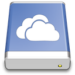

Microsoft OneDrive
===



# Connecting

> Microsoft Graph, OneDrive, and SharePoint support using a standard OAuth2 authorization flow.

The OneDrive connection profile is bundled by default and connects to the endpoint `https://graph.microsoft.com/v1.0/me`. Login with your personal or business account to `login.microsoftonline.com` when prompted to grant access to Cyberduck.

1. OneDrive uses OAuth 2 for authentication with `graph.microsoft.com`. When opening a connection, a web browser window is opened to grant access to OneDrive for Cyberduck.
	```{image} _images/Microsoft_OneDrive_OAuth_Authorization.png
	:alt: OAuth 2 Authentication
	:width: 500px
	``` 
2. Copy the authorization code into the login prompt in Cyberduck to complete authentication. Subsequent connections will not require authorization, unless the refresh token itself is expired due to inactivity.


## Multiple Accounts

You can connect to multiple accounts at the same time. Create a new bookmark for every account and run through the OAuth flow.

## OAuth Reset

If you have accidentally logged in with the wrong OneDrive Account or want to change the login of the OneDrive bookmark you can reset the OAuth token by deleting the entries related to `https://Microsoft OneDrive (user)@login.microsoft.com` out of the *Windows Credential Manager* or on macOS out of *Keychain Access.app*.

## Expiry

All authentication codes expire after 90 days. If you get the error message `Forbidden. The caller doesn't have permission to perform the action. [...]` due to this known issue remove all entries that are related to `Microsoft OneDrive` and `graph.microsoft.com` from *Keychain Access.app* or *Windows Credential Manager*. After that, you'll be prompted to reauthenticate.

## Which Protocol to Choose?

|  | Allows access to | Remarks | Bundled by default |
| --- | --- | --- | :---: |
| Microsoft OneDrive | Your Drive, and shared files	| Works with your personal and business OneDrive | Yes |
| [Microsoft SharePoint](SharePoint) | All sites document libraries and accessible group document libraries<br/><br/>**prior Cyberduck 7.8 / Mountain Duck 4.4:** The default sites document libraries and accessible group document libraries | The connection profile is named Microsoft SharePoint Online in versions **prior Cyberduck 7.8 / Mountain Duck 4.4** | Yes |
| Microsoft SharePoint Site | A single SharePoint Site which isn't listed within the *Microsoft SharePoint profile* | Can't mount specific directories | Yes |
| Microsoft SharePoint Document Library	| Can't mount specific directories | Does not allow access to groups<br/><br/>Only needed for versions **prior Cyberduck 6.9 / Mountain Duck 2.7** | No |

### Office 365 Deutschland

```{attention}
The separate `Microsoft Cloud Deutschland` won't be available anymore after 26. Oct 2021. For more information regarding the migration refer to this [announcement article](https://www.microsoft.com/de-de/cloud-platform/germany-cloud-regions).
```

1. {download}`Download<https://svn.cyberduck.io/trunk/profiles/Microsoft%20365%20China%20OneDrive.cyberduckprofile>` the *Microsoft Office 365 Deutschland OneDrive* profile
2. Use the *Microsoft Office 365 Deutschland OneDrive profile* and login with your `*.onmicrosoft.de` account to `login.microsoftonline.de` to connect to your OneDrive

## Administrator Consent Required

Depending on the setup of your AAD you may need to perform several steps in order for you to be able to access your OneDrive. Please get in contact with your domain administrator for following steps.

### Manually Adding Cyberduck & Mountain Duck

```{Important}
Cyberduck 7.8 and later or Mountain Duck 4.4 and later required
```

Copy the link that corresponds to your used version, and send it to your domain administrator, this will add Cyberduck to the domain and all users are allowed to access Cyberduck in the future.

* [Grant administrator consent](https://login.microsoftonline.com/organizations/v2.0/adminconsent?client_id=f40bc18f-cd02-4212-b7f1-15243e4e2ad3&redirect_uri=https://cyberduck.io/oauth&scope=sites.readwrite.all%20files.readwrite.all%20offline_access%20user.read)

### Automatically Allow Users to add Apps to the Domain

If applicable and trusted you may set `Users can consent to apps accessing company data on their behalf` to `Yes` at the [AAD Portal](https://aad.portal.azure.com/#blade/Microsoft_AAD_IAM/StartboardApplicationsMenuBlade/UserSettings). This will allow users in the future to add apps without Admin-consent.

### Admin Consent Requests (Preview)

There is a preview method of review application consent through the AAD Portal. Please enable `Users can request admin consent to apps they are unable to consent to` to `Yes` in the [Enterprise applications - User settings](https://aad.portal.azure.com/#blade/Microsoft_AAD_IAM/StartboardApplicationsMenuBlade/UserSettings). The domain administrator may now review all consents centrally at [Admin consent requests (Preview)](https://aad.portal.azure.com/#blade/Microsoft_AAD_IAM/StartboardApplicationsMenuBlade/AccessRequests).

# Cyberduck CLI

You can list the root contents of your OneDrive with [Cyberduck CLI](https://duck.sh/) using

	duck --list onedrive:/

Refer to the [Cyberduck CLI](../CLI/index) documentation for more operations. For subsequent invocations make sure to include the `--username` parameter and set it to the email address registered with Microsoft to allow the lookup of previously saved OAuth tokens.

# Search

```{attention}
This only applies to Cyberduck.
```

You can [search recursively](../Cyberduck/Browser#filter-search) for files fast without browsing folders first.

# Limitations

There are some limitations that you should keep in mind while working with.

- We've added support for Microsoft 365 China in **Cyberduck 7.8 / Mountain Duck 4.4** but aren't able to verify if it works properly.
- No interoperability with Microsoft 365 for US Government (other services may apply as well)