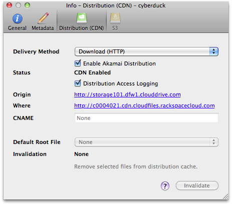

Akamai (CDN) Support
====

Akamai is the [CDN provider for Rackspace Cloudfiles](https://www.rackspace.com/openstack/public/cdn-content-delivery-network). A container can be enabled for *Akamai* in the *Distribution (CDN)* tab of the [Info](../cyberduck/info.md) panel.



# Basic (Download HTTP) Distributions

Used to serve static content. The files you elect to be public are shared out over a content distribution network with locations all over the world. The first time your content is served to a worldwide user (one in Tokyo, for example), a copy of the content will be stored in cache on the edge servers in that location. The next time the content is requested, it's pulled directly from the cached copy on the edge servers, dramatically reducing delivery time.

**Example Configuration:**</br>


# Deployment Status

The configuration updates are fully propagated status switches to *CDN Enabled*.

# Distribution Access Logging

When this option is enabled in the *File → Info → Distribution (CDN)* panel of a container, access logs are written to `/.CDN_ACCESS_LOGS`. Use *View → Show Hidden Files* to access the `*.gz` log files.

# Invalidation

To force the CDN to refetch the files from the container source, you can invalidate (aka purge) objects from edge locations. Use the *Invalidate* option *File → Info → Distribution (CDN)* to remove objects or the entire container from the CDN cache.

# Index File

You can assign a default root object for your distribution. This default object will be served when Akamai receives a request for the root of your distribution – i.e., your distribution’s domain name by itself.

# URLs

You can access all URLs (including from CDN configurations) from the menu *Edit → Copy URL* and *File → Open URL*. 

```{note}
You must first open *File → Info → Distribution (CDN)* before these URLs are available.
```


# References

- [Content Delivery Network|CDN by Rackspace](https://www.rackspace.com/openstack/public/cdn-content-delivery-network)
- [Rackspace Launches New Content Delivery Networking Service with Akamai](https://www.rackspace.com/newsroom/rackspace-launches-new-content-delivery-networking-service-with-akamai)
- [Quickstart for Rackspace CDN](https://developer.rackspace.com/docs/cdn/quickstart/)
- [Rackspace CDN concepts](https://developer.rackspace.com/docs/cdn/v1/getting-started/concepts/)