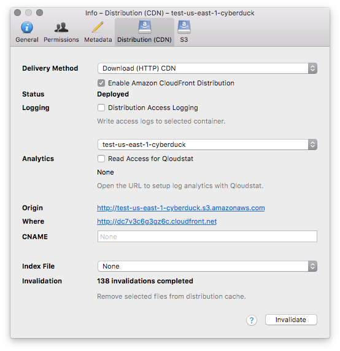
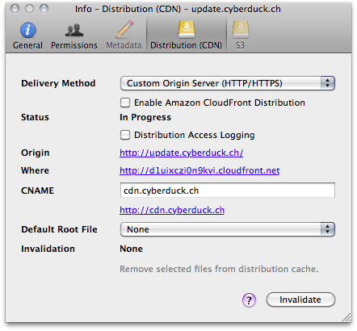
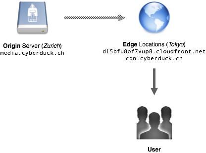

Amazon CloudFront Support
====

Amazon CloudFront delivers your static and streaming content using a global network of edge locations. Requests for your objects are automatically routed to the nearest edge location, so content is delivered with the best possible performance. You can enable download or streaming distributions using *File → Info → Distribution* for a [S3](../protocols/s3/index.md) bucket or a custom origin distribution for any other source.

```{note}
Using CloudFront can be more cost effective if your users access your objects frequently because, at higher usage, the price for CloudFront data transfer is lower than the price for Amazon S3 data transfer. In addition, downloads are faster with CloudFront than with Amazon S3 alone because your objects are stored closer to your users.
```

# Permissions

Make sure your objects in the bucket you want to enable distribution for are world-readable. In *File → Info → Permissions* give `READ` permission to *Everyone* (`http://acs.amazonaws.com/groups/global/AllUsers`).

# Basic (Download HTTP) Distributions

Delivery method _Download (HTTP) CDN)_ used to serve static content from a S3 bucket as an origin.



# Website Configuration Endpoint Distributions

Delivery method _Website Configuration (HTTP)_ to enable a [website endpoint](../protocols/s3/index.md#website-configuration) with no CDN features. This does *not* use any CloudFront feature.

# Website Configuration Endpoint Distributions with CloudFront CDN

Delivery method _Website Configuration (HTTP) CDN_  is using a custom origin CDN distribution with a [website endpoint](../protocols/s3/index.md#website-configuration) as a source to make use of the website endpoint features in CloudFront.

```{attention}
You must also enable the website endpoint using the delivery method _Website Configuration (HTTP)_ to make sure the CloudFront edge locations can fetch the content from the origin.
```

## Reference

- [Using CloudFront with the new Amazon S3 static website hosting features](https://forums.aws.amazon.com/ann.jspa?annID=921)

# Streaming (RTMP) Distributions
Delivery method _Streaming (RTMP) CDN)_ used to serve [media](http://en.wikipedia.org/wiki/Flash_Video) using a [streaming protocol](http://en.wikipedia.org/wiki/Real_Time_Messaging_Protocol).

```{attention}
Discontinued on December 31, 2020 within CloudFront. For further information refer to the [AWS announcement](https://forums.aws.amazon.com/ann.jspa?annID=7356).
```

## Playback Configuration

Copy the `RTMP` URL for a given file in a bucket with a streaming distribution enabled is displayed in the Info window *Distribution (CDN)* tab with *Streaming (RTMP)* selected as the delivery method. Where to put the URL depends on the client player you are using.

# Custom Origin (HHTP/HTTPS) Distributions

A [custom origin](https://docs.aws.amazon.com/AmazonCloudFront/latest/DeveloperGuide/private-content-overview.html#forward-custom-headers-restrict-access) is an origin server that isn't hosted on Amazon S3. The origin server holds the original, definitive versions of your content. You can connect to any [FTP](../protocols/ftp.md), [SFTP](../protocols/sftp.md) or [WebDAV](../protocols/webdav/index.md) server and configure it as an origin server for content distribution with Amazon CloudFront in the *Distribution (CDN)* tab of the [Info](../cyberduck/info.md) panel. The hostname from the *Web URL* configured in the bookmark is used to configure the origin of the CDN.



- Adjust the [Web URL](../cyberduck/bookmarks.md#http-url) of the bookmark to the host where you want to CloudFront look for the original content. If the scheme of the Web URL is `http` the origin HTTP port of the distribution is set to the port number in the Web URL (defaults to `80`) and the HTTPS port is set to `443`. If the scheme is `https` the origin HTTPS port of the distribution is set to the port number in the Web URL (defaults to `443`) and the HTTP port is set to `80`.
- Set the *Path* of the bookmark to the document root of your web server. This allows you to select files for [invalidation](../cyberduck/info.md#object-invalidation) or set the [default root object](../cyberduck/info.md#index-file).
- Connect to the server and select the *Distribution (CDN)* panel from the [Info](../cyberduck/info.md) window.
- Check the *Origin URL* displayed and enable the distribution with *Enable Amazon CloudFront distribution*.
- Refresh the status of the distribution using *`⌘R`*. The initial status is *In Progress* and should subsequently change to *Deployed* when the changes in Amazon CloudFront have propagated.
- Click the *Where* URL to load the content over the CDN.

**Example Configuration:**</br>
The first time your content is served to a worldwide user (one in Tokyo, for example), a copy of the content is fetched from the origin server and stored in cache on the edge servers in that location. The next time the content is requested, it's pulled directly from the cached copy on the edge servers, dramatically reducing delivery time.



| | | |
|---|---|---|
| Server | media.cyberduck.ch |	Hostname configured in bookmark to connect to. If this is different than what hostname CloudFront should fetch the origin content from, edit the hostname in the Web URL of the bookmark. |
| CNAME | cdn.cyberduck.ch | Alias for hostname assigned by the CloudFront distribution |
| Bookmark Path | `/usr/home/dkocher/cyberduck.ch/` | The Web Server Document Root |
| Selected File | `/home/dkocher/cyberduck.ch/img/cyberduck.icon.png` | A file selected in the browser |
| HTTP URL | http://media.cyberduck.ch/img/cyberduck.icon.png | Origin URL for the resource |
| CDN URL | http://d15bfu8of7vup8.cloudfront.net/img/cyberduck.icon.png | URL for the resource assigned by the CloudFront distribution |
| CDN CNAME URL | http://cdn.cyberduck.ch/img/cyberduck.icon.png | URL for resource in CDN with custom hostname registered in the DNS |

# Options
Refer to [Info](../cyberduck/info.md#cdn-panel) for configuration options.

# Copy URLs
CloudFront URLs are available in the regular *Copy URL* menu. Refer to [Open or Copy HTTP URL](../cyberduck/browser.md#open-or-copy-http-url).

# Access S3 through CloudFront
You can access S3 buckets through CloudFront. Although not a typical use case, this may be of interest to save bandwidth costs when working with files in S3. For example using [Cyberduck CLI](../cli/index.md).

```{code-block}
duck --user anonymous --list s3://djynunjb246r8.cloudfront.net/
```

# References

- [Amazon CloudFront FAQs](http://aws.amazon.com/cloudfront/faqs/)
- [Video on Demand and Live Streaming Video with CloudFront](https://docs.aws.amazon.com/AmazonCloudFront/latest/DeveloperGuide/on-demand-streaming-video.html)
- [Edge Locations](http://aws.amazon.com/cloudfront/#details)