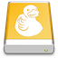

Cyberduck & Mountain Duck Help
====

```{toctree}
:hidden:

cyberduck/index
cli/index
mountainduck/index
protocols/index
cdn/index
cryptomator/index
```

## Support

If you have a feature request or bug to report you can open a new ticket. The pages below has all the information on how to collect relevant log files.

- [Cyberduck Support](cyberduck/support.md)
- [Mountain Duck Support](mountainduck/support.md)
- [CLI Support](cli/support.md)

 [Cyberduck](cyberduck/index.md)
----

Cyberduck is a libre server and cloud storage browser for Mac and Windows. With an easy-to-use interface, connect to servers, enterprise file sharing, and cloud storage.

### [Frequently Asked Questions (FAQ)](cyberduck/faq.md)

Read more about system requirements, registration keys and incompatibilities.

 [Mountain Duck](mountainduck/index.md)
----

Mountain Duck lets you mount server and cloud storage as a disk in Finder on macOS and the File Explorer on Windows with a minimal User Interface and Smart Synchronisation feature that allows making files available offline.

## [Client-side Encryption (Cryptomator)](cryptomator/index.md)

Support for client side encryption with Cryptomator interoperable vaults. Transparent, client-side encryption to secure your data on any server or cloud storage. Encryption for data at rest prevents unauthorized access regardless of the server or cloud storage infrastructure.

## [Command Line Interface](cli/index.md)

Command Line Interface (CLI) for Mac, Windows & Linux.

## [Supported Protocols](protocols/index.md#protocols)

All major server and cloud storage protocols are supported to connect to just about any server or cloud storage.
