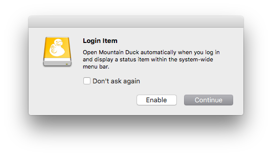
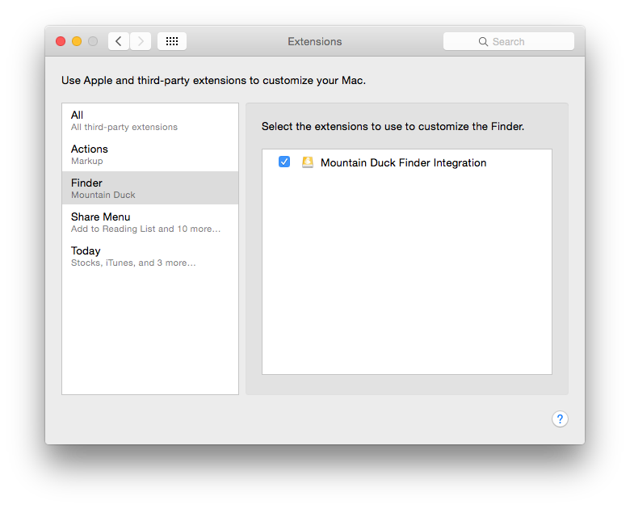
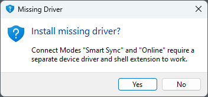

Installation
====

::::::{tabs}
:::::{group-tab} macOS

**Download**<br/>
Move the unzipped application bundle *Mountain Duck.app* from the Downloads to the `/Applications` folder on your computer.

:::{note}
No admin privileges for installation is required.
:::

**Mac App Store**<br/>
Mountain Duck is installed through the Mac App Store in `/Applications`. You can always reinstall Mountain Duck on any Mac you own from the Mac App Store in *→ App Store... → Purchased*.

**Login Item**<br/>
You can choose to open Mountain Duck when you log into your computer. The application will appear in *System Settings → General → Login Items & Extensions → Open At Login*.



**Finder Extension**<br/>
Enabling the _Mountain Duck Finder Extension_ provides the following options in Finder.app.

- **Context menu items** for files selected on a mounted volume with [options](../connect/sync.md#context-menu-options) such as to *Reload* the folder listing and copy & open URLs of files.
- **Badges** on file icons to display the [sync status](../connect/sync.md#status-of-files).

::::{tabs}
:::{tab} macOS 12
Enable the extension in *System Preferences → Extensions → Finder*.
:::
:::{tab} macOS 13-14
Enable the extension in *System Settings → Privacy & Security → Extensions → Added Extensions*.
:::
:::{tab} macOS 15.0-15.1
The option to manage third-party extensions is no longer available in  *System Settings*.
:::
:::{tab} macOS 15.2-
Enable the extension in *System Settings → General → Login Items & Extensions → File Providers*.
:::
::::

 

:::::
:::::{group-tab} Windows

**Installer**<br/>
[Download](https://mountainduck.io/changelog/) the *Mountain Duck Installer.exe* and install Mountain Duck with administrator privilege.


**MSI**<br/>
[Download](https://mountainduck.io/changelog/) MSI Installer for corporate environments. Requires prior installation of *Microsoft .NET Framework 4.7.2*.

:::{note}
Using the MSI Installer, you'll have to install the *MSI Package Shell Extension for 32bit applications* **and** *MSI Package Shell Extension for 64bit applications* separately. Both packages are needed to enable the explorer extension.
:::

:::::
::::::

## System Requirements

:::::{tabs}
::::{group-tab} macOS

- Mountain Duck 5.0.0 or later requires *macOS 13* or later
- Mountain Duck 4.14 or later requires *macOS 10.13* or later
- Mountain Duck 3.3.5 or later requires *macOS 10.12* or later
- Mountain Duck 3.0.1 or later requires *macOS 10.11* or later

::::
::::{group-tab} Windows

Requires *.NET Framework 4.7.2.* If the {download}`.Net Framework installation<https://dotnet.microsoft.com/download/dotnet-framework/net472>` fails, download it manually.

- Mountain Duck 5.0.0 or later requires *Windows 10 1809 (17763)* or later.
- Mountain Duck 4.13.0 or later requires *Windows 10 (14393) or Windows Server 2016* or later on 64 Bit.
- Mountain Duck 3.2.0 or later requires *Windows 7, Windows 8.1, Windows 10 (14393)* or later on 64Bit.
- Mountain Duck 3.0.1 or later requires *Windows 7* or later.

::::
:::::

## Registration Key

Double-click the file `.mountainducklicense` to apply the license and register Mountain Duck. Alternatively, you can copy the key file to the [application support folder](../support/index.md#application-support-folder).

:::::{tabs}
::::{group-tab} macOS

You can manually install the registration key in

- `~/Library/Group Containers/G69SCX94XU.duck/Library/Application Support/duck/`

::::
::::{group-tab} Windows

You can install the registration key either in:

- `%AppData%\Cyberduck`
- `C:\Program Files\Mountain Duck`

::::
:::::

### Known Issues

#### Not a Valid Registration Key

This error message appears if you try to use an old license key for a newer version.
[Upgrade](https://mountainduck.io/buy/upgrade/) your license to the latest version of Mountain Duck or download an older version from [Mountain Duck changelog](https://mountainduck.io/changelog/).

### Windows Installation

#### Optional Driver Installation
Connecting using [_Online_](../connect/online.md) or [_Smart Synchronization_](../connect/sync.md) connect mode requires the installation of an additional file system driver in Windows. The following prompt is displayed when attempting to connect the first time.



:::{tip}
The installation of the file system driver is not required for [_Integrated_](../connect/integrated.md) connect mode.
:::

#### Error Code 0x24C 

If you get the error code `0x24C` uninstall the client, reboot the system, and reinstall the client.

```
0x24C. A volume has been accessed for which a file system driver is required that has not yet been loaded.
```

#### Troubleshooting 

For troubleshooting purposes when reaching out for support, please share the latest installation log. The installation log file prefixed `Mountain Duck_` can be found in `%Temp%`.

## Installation with Device Management Software

You can distribute Mountain Duck with the help of Active Directory or a system management tool like Intune on Windows or JAMF on macOS and copy the license file into the [application support folder](../support/index.md#application-support-folder) after installing Mountain Duck. Installation packages are provided in MSI (Windows) and PKG (macOS) formats.

### Defaults

- Add preconfigured connection profiles and bookmarks this way by copying the connection profile file (`.cyberduckprofile`) into the *Profiles* folder or the bookmark file (`.duck`) into the *Bookmarks* folder within the [application support folder](../support/index.md#application-support-folder).
- Share default settings by using the [default.properties file](../preferences.md#hidden-configuration-options). 

## Uninstall

Using Windows Command Line:

- Regular uninstall:
	`Mountain Duck Installer-<version>.exe /uninstall`
- Silent uninstall:
	`Mountain Duck Installer-<version>.exe /uninstall /quiet`

### Complete Uninstall

Follow the steps below to uninstall Mountain Duck completely.

:::::{tabs}
::::{group-tab} macOS

1. Close the application and navigate to the application folder using the shortcut `⌘⇧A`. Select *Mountain Duck.app* and delete the application by choosing *File → Move to Trash*.
2. Navigate to the *Group Containers* folder within *~/Library/* and delete the folder *G69SCX94XU.duck*. If you changed the cache location you will have to delete that folder as well.
3. Run the _Terminal.app_ command to reset and erase the settings for Mountain Duck:
	`defaults delete io.mountainduck`
4. **Optional:** Delete all saved login credentials regarding Mountain Duck within *Keychain Access.app*.

::::
::::{group-tab} Windows

1. Close the application and open the start menu using the shortcut `Ctrl Esc`. Search for *Apps & Features* and move to the entry *Mountain Duck*. Click on the application, choose *Uninstall*, and confirm your intentions by clicking *Uninstall* again.
2. Navigate to the `%AppData%`and delete the folder *Cyberduck*
3. Navigate to `%LocalAppData%`and delete the folder *Cyberduck*
4. **Optional:** Delete all saved login credentials regarding Mountain Duck within *Windows Credential Manager*.

::::
:::::