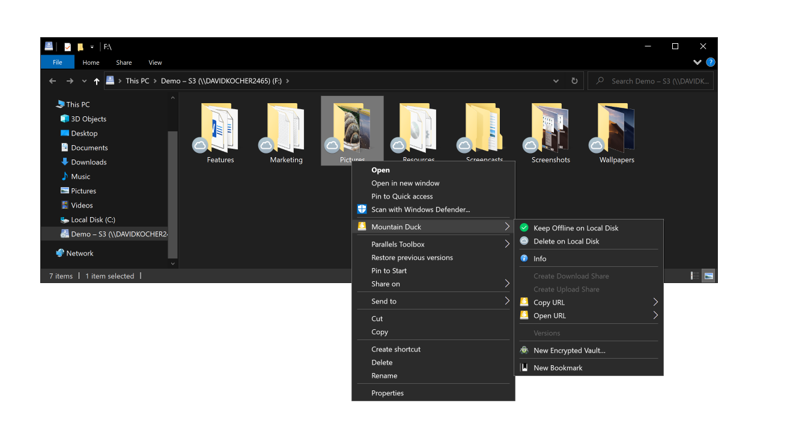
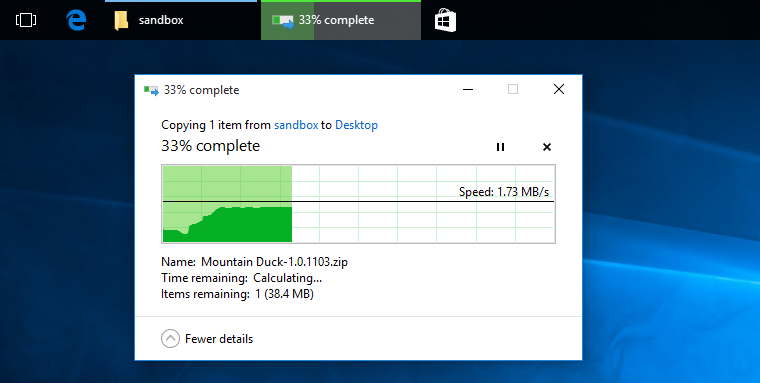

User Interface
====

:::{contents} Content
:depth: 2
:local:
:::

## User Interface

Mountain Duck runs in the status bar (macOS) and taskbar (Windows).

:::::{tabs}
::::{group-tab} macOS

:::{image} _images/Status_Bar_Menu_Mac_Dark.png
:alt: Status Bar Menu (macOS Dark)
:width: 800px
:::
<br/>
<br/>

Find the mounted volume in Finder. Choose *Go → Computer* or choose *Finder → General → Show these items on the desktop:* *Connected servers* to make it appear on your desktop.

:::{tip}
Make sure there is enough space left on right side of the notch or application menu items to make sure the _Mountain Duck_ is visible in the the system status bar. To rearrange status menus, press and hold the Command key while you drag an icon. When having multiple displays attached to your computer the status bar item  may not be visible on the main display but on the secondary display.
:::

::::
::::{group-tab} Windows


Right-click on the taskbar and select *Taskbar setting → Notification area → Select which icons appear on the taskbar*. Make sure Mountain Duck is selected in the list.

:::{tip}
If Mountain Duck is newly installed on a Windows 11 system, the tray icon must be revealed manually in *System Preferences → Personalization → Taskbar → Other system tray items*.
:::

::::
:::::

### Auto Start

You can choose to automatically open Mountain Duck when logging in. Refer to [Preferences](preferences.md#login-item). Re-opening the application will open previously mounted volumes. If you choose *Enable Login Item* and *Save Workspace* in *Preferences → General* and do not manually eject the volume prior to reboot it will reconnect after login.

## Bookmarks

Choose *Open Connection…* to add a new bookmark. To edit the connection settings of an existing bookmark, choose *<Bookmark> → Edit Bookmark*.

:::{note}
Bookmarks are shared between [Cyberduck](https://cyberduck.io/) and Mountain Duck.
:::

### Connect Mode

- **Default:** Use setting from *[Preferences](preferences.md#connect-mode)*
- **Online:** Do not synchronize any file to your computer. See [Online](connect/online.md) connect mode.
- **Smart Synchronization:** See [Smart Synchronization](connect/sync.md) connect mode.

:::{image} _images/Edit_Bookmark_macOS.png
:alt: Edit Bookmark (macOS)
:width: 500px
:::

:::{image} _images/Edit_Bookmark_Windows.png
:alt: Edit Bookmark (Windows)
:width: 500px
:::

### Nickname

The nickname determines the display of the bookmark in the menu and can be customized.

:::{tip}
The nickname determines the name of the mounted volume in Finder.app on macOS or drive in File Explorer on Windows. Also refer to [Mount Location](preferences.md#mount-location).
:::

### Labels

Assign multiple labels to bookmarks. Bookmarks are grouped in folders in the status bar menu by their assigned labels.

:::{image} _images/Taskbar_Menu_Bookmark_Groups_Large_Icons_Windows.png
:alt: Taskbar Menu Bookmark Groups (Windows, Large Icons)
:width: 400px
:::

### Read-Only Volume

Select *Options: Read Only* in the bookmark to mount the volume as read-only and disallow any write operations on the remote disk.

### Drive Letter (Windows)

Always assign the same drive letter to the mounted volume.

:::{note}
The number of concurrent connected bookmarks is limited by the number of available drive letters. You can have a total of 26 drives on your system.
:::

## Filter

You can search for bookmarks with the filter input field in the menu. Bookmarks not matching the input are greyed out.

:::{image} _images/Bookmark_Search_Input.png
:alt: Bookmark Search Input
:width: 400px
:::

## Bookmark Status

The bookmark can show three different status lights:

- **No light:** No current connection to this bookmark.
- **Green light:** Currently connected to this bookmark. The bookmark is completely synced and idle.
- **Orange light:** Currently connected to this bookmark. There is at least one active process.

You can can put the currently connected bookmarks on top of the bookmark list regardless of the sorting by using a [hidden configuration option](../tutorials/hidden_properties.md):

```
bookmark.menu.sort.connected=true
```

## Connect

Choose *<Bookmark> → Connect* to mount the server as a volume in the *Finder.app* on macOS or the *File Explorer* on Windows. You can connect to multiple servers and have several volumes mounted. All operations on the remote files and folders can then be performed like on local files.

:::{tip}
You can just select the menu item with the bookmark name to connect, too. If you are already connected, selecting the menu item will reveal the volume in *Finder.app*.
:::



### Connect Using the Command Line Interface

You can mount volumes using your command-line interface (CLI) by opening a bookmark file.

::::{tabs}
:::{group-tab} macOS

Use
`open -a "Mountain Duck" ~/Library/Group Containers/G69SCX94XU.duck/Library/Application Support/duck/Bookmarks/*.duck` in *Terminal.app*

:::
:::{group-tab} Windows

Enter the command `<path to Mountainduck.exe> %AppData%/Cyberduck/Bookmarks/<Bookmarkfile>` in *cmd.exe*.

:::
::::

## Notifications

Notifications of the connection status are posted to the *Notification Center* of the operating system.

- *Filesystem mounted*
- *Filesystem unmounted*
- *Errors:* If there is a network connectivity issue while the remote server is mounted, an alert is displayed that allows you to retry the connection or disconnect and unmount the volume.
- [Sync Notifications](connect/sync.md#notifications)

:::{image} _images/File_Added_Notification_Windows.png
:alt: File Added Notification (Windows)
:width: 600px
:::

## Disconnect

Choose *<Bookmark> → Disconnect* to unmount a volume. Alternatively, eject the volume in *Finder.app* or *File Explorer*.

::::{tabs}
:::{group-tab} macOS

Choose *File → Eject* in *Finder.app* for the selected volume or control click to choose *Eject*.

**Disconnect using command line**<br/>
You can unmount volumes using your command-line interface (CLI). Use `umount <bookmark nickname>` in *Terminal.app*.

:::
:::{group-tab} Windows

In *File Explorer* in "This PC" view or the sidebar on the left of the *File Explorer* window, open the context menu for your mounted drive and select *Disconnect*.

**Disconnect using command line**<br/>
You can unmount volumes using your command-line interface (CLI). Use `net use <drive letter>: /delete` in *cmd.exe*

:::
::::

## Copying Files

Drag files in *Finder.app* an macOS or *File Explorer* on Windows to move and copy files. You can also access the mounted volume with any other application and command-line interface.




```{admonition} macOS only
:class: tip
Using _Integrated_ connect mode, files dragged are moved by default instead of copied. Drag the file with the ⌥ key pressed (macOS) to copy instead.
```

## Context Menu in Finder and Windows File Explorer

A context menu in *Finder* on macOS and *File Explorer* on Windows allows various actions on files.

:::{image} _images/Context_Menu_Windows.png
:alt: Context Menu (Windows)
:width: 600px
:::

:::{admonition} macOS only
:class: tip

Please make sure to enable the Mountain Duck [Integration](#context-menu-in-finder-and-windows-file-explorer) in *System Preferences → Extensions → Finder Extensions*. For **macOS Ventura and later**, the setting can be found in *System Settings → Privacy & Security → Extensions → Added Extensions*.
:::

### Sync Options

*Keep Offline on Local Disk* or *Delete on Local Disk* to manage caching status.
Refer to [Sync Options](connect/sync.md#keep-offline).

### Reload

Changes from the server are not immediately visible. The folder listing in the file browser may become outdated when another application adds, removes, or modifies files on the server. Mountain Duck periodically polls for changes for open folders in _Finder.app_ on macOS or _File Explorer_ on Windows about every minute in both _Online_ and _Smart Synchronization_ connect modes. Choose *Reload* from the context menu to refresh the directory listing.

:::{admonition} Windows only
:class: tip

Use _F5_ in _File Explorer_ to refresh the folder listing.
:::

:::{tip}
Enable the *Index Files* option in [*Preferences → Sync*](preferences.md#index-files) to allow new files on the remote storage to be detected periodically for previously opened directories regardless of any open window for the folder in _Finder.app_ on macOS or _File Explorer_ on Windows in _Smart Synchronization_ connect mode.
:::

### Share

- *Share…:* Create an URL to share with someone else to allow downloading the file or folder.
- *Request file…:* Create an URL to share with someone else to allow uploading files to the selected folder.

Right-click files on a mounted drive will open a menu with items to copy & open HTTP URLs or create share links of files. This will include the Origin URL, [HTTP URLs](../cyberduck/bookmarks.md#web-url) and [temporary signed URLs in S3](../protocols/s3/index.md#public-urls).

- *Copy URL*
- *Open URL*

[Read more](../cyberduck/share.md) about sharing options.

:::{image} _images/Mountain_Duck_Finder_Context_Menu.png
:alt: Mountain Duck Finder Context Menu
:width: 1000px
:::

### Versions

*Quick Look* or *Restore* previous versions of documents on servers supporting versioning.
[Read more](versions.md) about versioning.

### New Bookmark

Right-click on white space within the mounted drive in Finder or Explorer to add a bookmark including the selected path.

### Open in Terminal

Right-click on a folder and choose *Open in Terminal* to open an SSH connection to the server in Terminal for SFTP bookmarks.

:::{admonition} Mac App Store
:class: attention
The setting is not available in the version installed from the Mac App Store. Refer to [#7664](https://github.com/iterate-ch/cyberduck/issues/7664).
:::

### Info Panel

Right-click on a file and choose *Info* to change permissions, ACLs, metadata, and other service provider-specific settings on a file. Refer to [Info Window](info.md).

### New Encrypted Vault…

Create a new Cryptomator Vault. [Read more](../cryptomator/index.md) about client-side encryption.

### Lock/Unlock Vault

Lock or unlock a Cryptomator Vault.

## Usage Scenarios

### Mirror Files to Remote Server or Cloud Storage with `rsync`

Use `rsync` or any other of your preferred tools to mirror files for example to an S3 bucket. Set the `--timeout=TIME` option in `rsync` (in seconds) if you have low bandwidth or high latency connection.

### Open Remote Files in Text Editor

*Sublime Text* and other editors allow you to open folders to work on multiple files.

### Create ZIP Archive of Files on FTP Server or Cloud Storage

Use your preferred archive utility to create a compressed archive of files already stored on the server.
