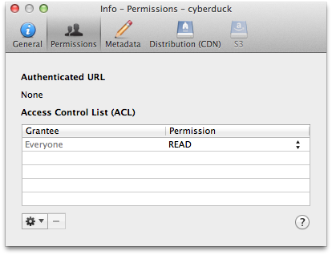
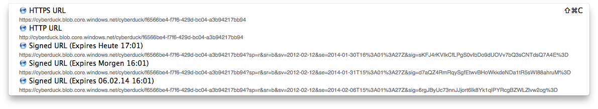

Windows Azure Blob Storage
====

```{image} _images/azure.png
:alt: Azure Blob Storage
:width: 128px
```

> Massively scalable object storage for unstructured data

# Connecting to Windows Azure Blob Storage

## Hostname

Edit the hostname to connect to your account in the format `<account>.blob.core.windows.net`.

```{warning}
Azure Files Storage is not supported.
```

## Credentials

### Account and Key

You must obtain the login credentials (Account Name and Primary Access Key) from [portal.azure.com](https://portal.azure.com/). You can find the keys in the section *Access keys*. In the login prompt of Cyberduck upon connecting to Windows Azure you enter the *Storage Account Name* for the username and *Primary Access Key* for the password.

### Shared Access Signatures (SAS)

You can use a [SAS](https://docs.microsoft.com/en-us/azure/storage/common/storage-sas-overview) when you want to provide access to resources in your storage account to any client not possessing your storage account's access keys.

- [Download](https://github.com/iterate-ch/cyberduck/raw/master/profiles/Azure%20(Shared%20Access%20Signature%20Token).cyberduckprofile) the Azure (Shared Access Signature Token) profile

## Cyberduck CLI

You can list all containers with [Cyberduck CLI](https://duck.sh/) using

	duck --username <storageaccount> --list azure://<storageaccount>.blob.core.windows.net/`

For a storage account named `kahy9boj3eib` that would be 

	duck --username kahy9boj3eib --list azure://kahy9boj3eib.blob.core.windows.net/

Refer to the [Cyberduck CLI](../cli/index.md) documentation for more operations.

# Access Control (ACL)

You can edit ACLs in *File → Info (macOS `⌘I` Windows `Alt+Return`) → Permissions*. To make objects in a container publicly accessible, choose *Everyone → READ*. Note that this applies to all files in a container.



# Containers

To create a new container in your account, browse to the root and choose *File → New Folder... (macOS `⇧⌘N` Windows `Ctrl+Shift+N`)*.

# Blob Type
Uploads are stored as append blob type by default. You can use the [hidden configuration option](../cyberduck/preferences.md#hidden-configuration-options) `azure.upload.blobtype` which allows the values `BLOCK_BLOB`, `PAGE_BLOB` and `APPEND_BLOB`.

# Metadata

You can edit standard custom metadata. Choose *File → Info → Metadata* to edit custom headers.

## Default Metadata

Currently only possible using a [hidden configuration option](../cyberduck/preferences.md#hidden-configuration-options) you can define default headers to be added for uploads. Multiple headers must be separated using a whitespace delimiter. Key and value of a header are separated with `=`. For example, if you want to add an HTTP header for `Cache-Control` and one named `Creator` you would set

	defaults write ch.sudo.cyberduck azure.metadata.default "Cache-Control=public,max-age=86400 Creator=Cyberduck"

## Shared Access Signature URLs

A private object stored in Azure Storage can be made publicly available for a limited time using a signed URL. The signed URL can be used by anyone to download the object, yet it includes a date and time after which the URL will no longer work. Copy the signed URL from *Edit → Copy URL→ Signed URL*.



```{Note}
Currently are only 24h-signed URLs available
```

## Access Logs

Configure access logging for buckets in the *Info* panel.

# Limitations

- Container and blob [naming conventions](https://docs.microsoft.com/en-us/rest/api/storageservices/Naming-and-Referencing-Containers--Blobs--and-Metadata).
- [CDN configuration](https://docs.microsoft.com/en-us/azure/cdn/cdn-create-new-endpoint) is currently only possible using the web interface.

# Problems

## One of the Request Inputs is out of Range

Please follow the [Naming and Referencing Containers, Blobs, and Metadata](https://docs.microsoft.com/en-us/rest/api/storageservices/Naming-and-Referencing-Containers--Blobs--and-Metadata) guidelines.