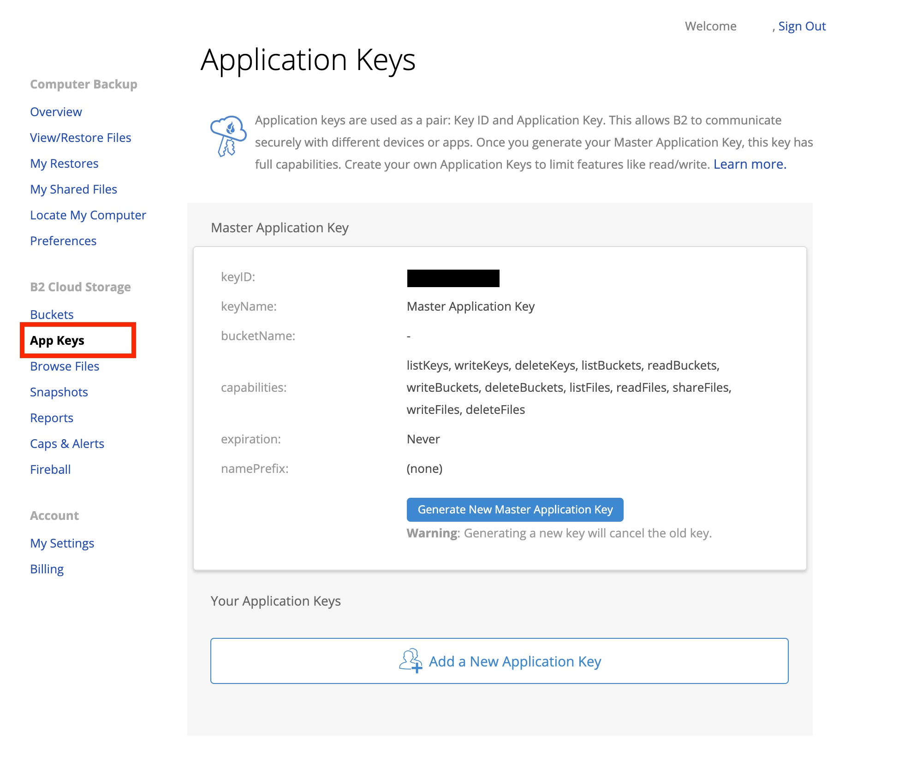
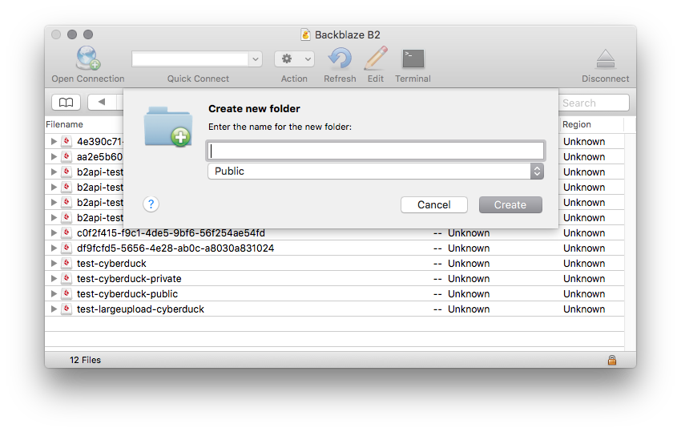
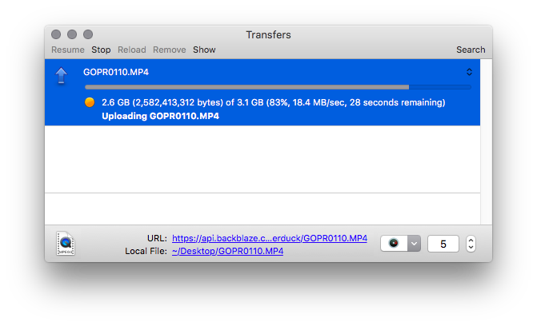

Backblaze B2
====


> [Backblaze B2 Cloud Storage](https://www.backblaze.com/b2/cloud-storage.html) works similar to Amazon S3 or Microsoft Azure, allowing you to store unlimited data in the cloud. But does it for 1/4th the cost.

```{contents} Content
:depth: 2
:local:
```

## Connecting

Obtain the login credentials from [backblaze.com](https://secure.backblaze.com/). Choose App Keys on the sidebar and generate a new application key. Once you have your credentials, choose B2 Cloud Storage from the list of protocols when editing a [bookmark](../cyberduck/bookmarks.md) or use the `b2://` scheme when using the [CLI](../cli/index.md).



### Authenticating Using Master Key

- The Master Application Key for an account can be found at the top of the *App Keys* page of the Backblaze website once you [signed in](https://secure.backblaze.com/user_signin.htm?netid=1624013329972).
- The key for your account has complete access but will become invalid if you generate a new one.
- The key information is only shown when generating the key and is not shown again, so make sure you save the credentials in a secure location if you plan on using this more than once.

Use your `Account ID` and `Master Application Key` to log in.

### Authenticating Using Application Key

Use your `Key ID` and `Application Key` to log in. The application key can be restricted to a single bucket.

#### How to Create Application Keys

1. Use the Backblaze website and [sign in](https://secure.backblaze.com/user_signin.htm?netid=1624013329972) to your account
2. Click on *App Keys* in the left-hand menu
3. Select *Add a New Application Key*
4. Specify the key settings and permissions and click on *Create New Key*
5. After the Application Key is created, a blue panel is displayed containing the `Key ID` and `Application Key` for the newly generated key.

```{important}
The key information will only appear once. Copy the information somewhere safe for later retrieval.
```

### Using S3 Compatible API

- {download}`Download<http://profiles.cyberduck.io.s3.amazonaws.com/Backblaze%20B2%20(S3%20API).cyberduckprofile>` the *Backblaze B2 (S3 API) Connection Profile* for preconfigured settings. 

```{Attention}
Buckets created prior to May 4th, 2020 are not S3 compatible and cannot be accessed
```

## Cyberduck CLI

You can list all buckets with [Cyberduck CLI](https://duck.sh/) using

	duck --username <application key> --list b2:/

Refer to the [Cyberduck CLI](../cli/index.md) documentation for more operations.

## Features

### Creating Buckets

Choose *File → New Folder* to create a new [bucket](https://www.backblaze.com/b2/docs/buckets.html) in the root of the browser.

[Bucket names](https://help.backblaze.com/hc/en-us/articles/217666908-What-you-need-to-know-about-B2-Bucket-names), notably:

- must be between 6 and 50 characters long;
- can only consist of alphanumeric characters or "-";
- are case insensitive;
- are globally uniques (i.e. across all Backblaze accounts);
- cannot begin with "b2-" (reserved for Backblaze use).



#### Private

Setting it to `allPrivate` means that every download requires an authorization token.

#### Public

Setting it to `allPublic` means that everybody is allowed to download the files in the bucket.

### File Versioning

You can view all revisions of a file in the browser by choosing *View → Show Hidden Files*.

#### Info → Versions

A list of file versions can be viewed in the *Versions* tab of the *[Info](../cyberduck/info.md#versions)* window. Files can be reverted to a chosen version of this list. Additionally, versions of the list can be deleted.

```{note}
`Bucket Versioning` has to be enabled within the *B2* tab of the *Info* window before the versions of the files are displayed.
```

### Authorized URL
Create an authorized URL to make files available publicly. Choose *File → Share…*. The shared URL expires in 7 days.

### Large File Uploads

Files larger than `200MB` are split into `100MB` chunks and uploaded with multiple connections. The number of connections used can be limited using the toggle in the lower right of the transfer window.



Large uploads can be resumed when interrupted.

#### Unfinished Large Uploads

You can view unfinished large uploads in the browser by choosing *View → Show Hidden Files*.

#### Checksum

If you want to have the SHA1 checksum set in the file info for the large file upload in `large_file_sha1` make sure to check *Preferences → Transfers → Checksum → Uploads → Verify checksum*.

### Edit Bucket Type

New buckets are private by default, meaning that you need a bucket authorization token to download the files. You can allow public access to files by opening the [ACL tab in the *Info* panel](../cyberduck/info.md#access-control-list-acl) and choose *Everyone → Read*.


### Edit Bucket Lifecycle Rules

Specify after how many days a file in a bucket should be hidden or deleted.

### Retries for Failed File Transfers

The number of times a retry attempt is made upon a failure such as `503 Service Unavailable` depends on the setting in *Preferences → Connection → Repeat failed networking tasks → Number of retries*.

## Share

Create download [shares](../cyberduck/share.md#backblaze-b2) of files for people with no access to your bucket using *File → Share...*.

## Known Limitations

### Modification Date

The modification date retention is supported using `src_last_modified_millis` for new files uploaded but without the option to adjust the modification date later.

### Rename and Move Files
<del>not supported.</del> Supported in Cyberduck 7 or later.

## References

- [Cyberduck - How to install and upload a file](https://help.backblaze.com/hc/en-us/articles/217994508)
- [Integrations](https://www.backblaze.com/b2/docs/integrations.html)
- [Backblaze B2 - Big File Beta](https://www.backblaze.com/blog/b2-big-data-big-files/)
- [How B2 Works](https://www.backblaze.com/b2/cloud-storage.html)
