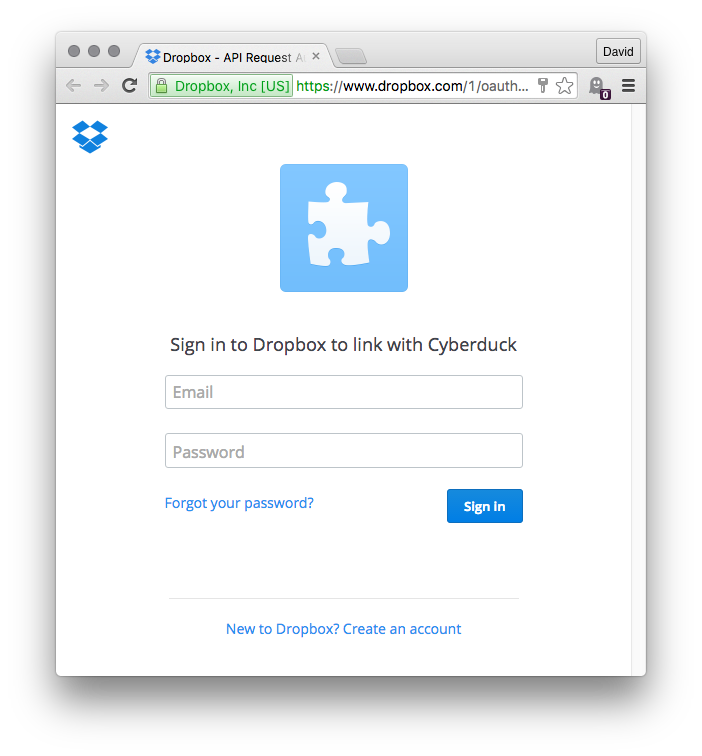
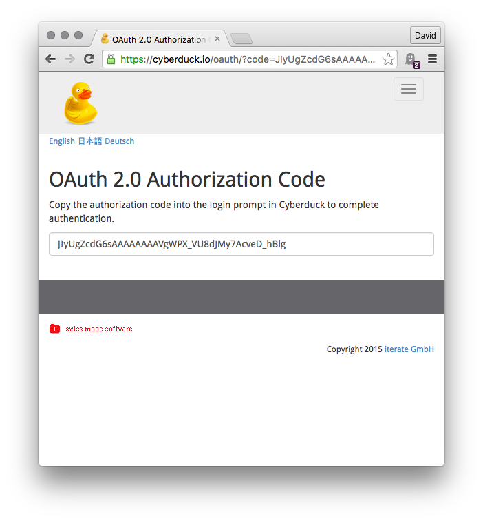

Dropbox
===

```{image} _images/dropbox.png
:alt: Send Command
:width: 128px
```

```{tip}
Access your [Dropbox](https://db.tt/49NiK95I) without syncing to your computer. Download [Mountain Duck](https://mountainduck.io/) as an alternative to *Dropbox Client*.
```

# Connecting

1. You will be asked to link Cyberduck to your Dropbox account on your first connection attempt.

2. Log in to Dropbox and paste the authorization code obtained to the login prompt.


## Multiple Accounts

You can connect to multiple accounts at the same time. Create a new bookmark for every account and run through the OAuth flow. Make sure to log out in your browser prior to setting up a new bookmark to make sure the new bookmark is linked to a newly authenticated account.

## OAuth Reset

If you have accidentally logged in with the wrong Dropbox Account or want to change the login of the Dropbox bookmark you can reset the OAuth token by deleting the entries related to `https://Dropbox (user)@api.dropboxapi.com` out of the *Windows Credential Manager* or on macOS out of *Keychain Access.app*.

# Cyberduck CLI

You can list the root contents of your Dropbox with [Cyberduck CLI](https://duck.sh/) using

	duck --list dropbox:/

Refer to the [Cyberduck CLI](../cli/index.md) documentation for more operations. For subsequent invocations make sure to include the `--username` parameter and set it to the email address registered with Dropbox to allow the lookup of previously saved OAuth tokens.

# Additional Information

## Shared Folders

If you want to access folders that are shared with you through Dropbox you have to add the desired folder to your own drive at the webpage of Dropbox. To do that, open your Dropbox Account within a web browser and navigate to the *Shared* section. Add the desired file or folder to your own drive by clicking on the *Add* button beside the file or folder.

## Search

```{attention}
This only applies to Cyberduck.
```

You can [search recursively](../cyberduck/browser.md#filter-and-search) for files fast without browsing folders first.

## Share

You can share an URL to provide access to a document in your Dropbox from *File → Share…*. Optionally set a password required to download the file. Choose *Cancel* to create a public URL with no password protection.

# Known Issues

## Restricted Content

Downloads may fail with a `409 Conflict (restricted_content)` error reply for files considered restricted.

```{attention}
The file cannot be transferred because the content is restricted. For example, sometimes there are legal restrictions due to copyright claims.
```

## Will not save the file or folder because of its name.

Uploads may fail with a `409 (disallowed_name)` error reply for files with certain characters in the filename.