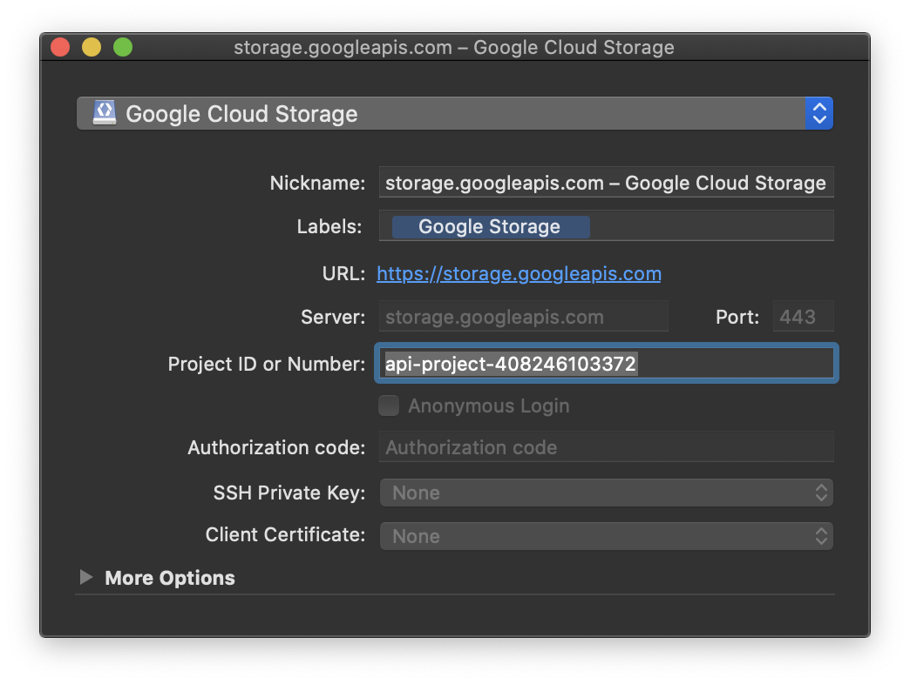
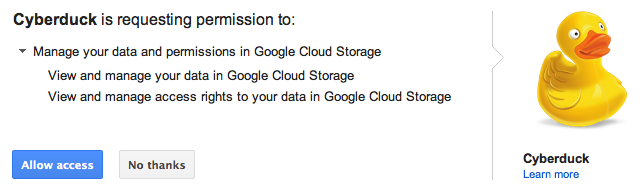
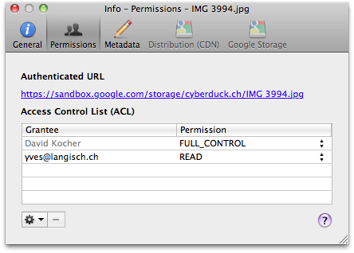

Google Cloud Storage
====

```{image} _images/googlestorage.png
:alt: Send Command
:width: 128px
```

> [Google Cloud Storage](https://cloud.google.com/storage/docs) is an S3 compatible service with pricing based on usage. Google Cloud Storage is interoperable with [S3](s3/index.md).

## Connecting

### Interoperable Access

For interoperable access please use an S3-compatible protocol (like Amazon S3, not Google Storage) with the server set to `storage.googleapis.com`.

You need to obtain the login credentials (Access Key and Secret) from the [Google Cloud Platform](https://console.cloud.google.com/) settings for "Storage". Please navigate to the [storage settings](https://console.cloud.google.com/storage/settings). Open the *Interoperability*-tab and enable *Interoperable Access*. After enabling you may now create a new key. For more information refer to the [Google Storage Documentation](https://cloud.google.com/storage/docs/migrating).

In the login prompt of Cyberduck you enter the *Access Key* for the username and *Secret* for the password. This allows you to connect to one project configured in your account.

### OAuth 2.0 Access

You must obtain the project ID (`x-goog-project-id`) of your project from the Google Cloud Platform under *Storage Access* from the Google Cloud Storage tab. [Direct link to Google Cloud Storage settings.](https://console.cloud.google.com/storage/settings)



In the login prompt of Cyberduck, you enter the `x-goog-project-id` for the username and enter the *Authorization Code* retrieved from the website where you grant Cyberduck access to your account.



You access the page with the authorization code from the link displayed in the login prompt. Click it to open it in a web browser window. You only need to get the authorization code from the website on the first login attempt. Subsequent OAuth authentications will use a refresh token retrieved from the service.

#### OAuth Reset

If you have accidentally logged in with the wrong Google Cloud Storage username or want to change the login of the Google Cloud Storage bookmark you can reset the OAuth token by deleting the entries related to `https://Google Cloud Storage (user)` out of the *Windows Credential Manager* or on macOS out of *Keychain Access.app*.

#### Custom OAuth Client ID

You can register a [custom OAuth 2.0 client ID](google_client_id.md) with Google to operate independently of our registered client ID.

## Cyberduck CLI

You can list all buckets with [Cyberduck CLI](https://duck.sh/) using

	duck --username <projectid> --list gs:/`

Refer to the [Cyberduck CLI](../cli/index.md) documentation for more operations.

## Creating a Bucket

When connecting the first time, you must first create a new bucket with *File → New Folder... (macOS `⌘N` Windows `Ctrl+Shift+N`)*. You can choose the default bucket region in *Preferences (macOS `⌘,` Windows `Ctrl+,`) → Google Storage*. The following multi-regions are supported to select from:

- `us.` Data centers in the United States.
- `eu.` Data centers within member states of the European Union.
- `asia.` Data centers in Asia.

## Storage Class

You can set the default [storage class](https://cloud.google.com/storage/docs/storage-classes#descriptions) for new files uploaded in *Preferences (macOS `⌘,` Windows `Ctrl+,`) → Google Storage → Default Storage Class*. A minimum storage duration applies to data stored using one of these storage classes. You can delete the data before it has been stored for this duration, but at the time of deletion you are charged as if the data was stored for the minimum duration. Available options are

- `STANDARD`. Standard Storage. No minimum storage duration.
- MULTI_REGIONAL. Equivalent to Standard Storage, except Multi-Regional Storage can only be used for objects stored in multi-regions or dual-regions.
- `REGIONAL`. Equivalent to Standard Storage, except Regional Storage can only be used for objects stored in regions.
- `NEARLINE`. Nearline Storage is a better choice than Standard Storage in scenarios where slightly lower availability, a 30-day minimum storage duration.
- `COLDLINE`. Coldline Storage is a very-low-cost, highly durable storage service for storing infrequently accessed data. Coldline Storage is a better choice than Standard Storage or Nearline Storage in scenarios where slightly lower availability, a 90-day minimum storage duration.

## Bucket Access Logging

When this option is enabled in the *Google Cloud Storage* panel of the Info (*File → Info (macOS `⌘I` Windows `Alt+Return`)*) window for a bucket or any file within, available log records for this bucket are periodically aggregated into log files and delivered to root in the target logging bucket specified. It is considered best practice to choose a logging target that is different from the origin bucket.


## Folders

Creating a folder inside a bucket will create a placeholder object named after the directory, has no data content, and the mime-type `application/x-directory`. Directory placeholder objects created in *Google Storage Manager* are [not supported](https://groups.google.com/group/gs-discussion/browse_thread/thread/fb90359bd714c717/44094e60372427d4#44094e60372427d4).

## Files

### Metadata

You can edit standard HTTP headers [add](../cyberduck/info.md#metadata-http-headers) custom HTTP headers to files to store [metadata](https://docs.aws.amazon.com/AmazonS3/latest/userguide/UsingMetadata.html). Choose *File → Info → Google Storage* to edit headers.

## ACLs

### Default ACLs

You can choose *canned ACLs* to be added to uploaded files or created buckets per default. *Canned ACLs* are predefined sets of permissions. 
The [default ACL](https://cloud.google.com/storage/docs/access-control/lists#predefined-acl) can be set within *Preferences (macOS `⌘,` Windows `Ctrl+,`) → Google Storage → Default ACL*.

|  | Applies to Buckets | Applies to Files |
| :--- | :---: | :---: |
| `private` | ✅ | ✅ |
| `public-read` | ✅ | ✅ |
| `public-read-write` | ✅ | ✅ |
| `authenticated-read` | ✅ | ✅ |
| `bucket-owner-read` | ❌ | ✅ |
| `bucket-owner-full-control` | ❌ | ✅ |

### Granting Access to Selected Users

You can give access to a specific user to a document by granting `READ` access to the email address registered with Google. The *Authenticated URL* from the *ACL* tab in the *Info* window with the format `https://sandbox.google.com/storage/<container>/<file>` will verify access to the resource using the Google Account login credentials.



The link will redirect to the file only after the user has successfully logged in to their Google Account and is listed in the ACL you have just edited.

### Granting Access to Google App Domain

Google Apps customers can associate their email accounts with an Internet domain name. When you do this, each email account takes the form username@yourdomain.com. You can specify a scope by using any Internet domain name that is associated with a Google Apps account.

### Granting Access to Members of Google Group

Every Google group has a unique email address that is associated with the group. For example, the Google Storage for Developers group has the following email address: gs-discussion@googlegroups.com. You can find the email address that is associated with a Google group by clicking About this group, which appears on the homepage of every Google group.

### Permissions

The following permissions can be given to grantees:

|  | Bucket | Files |
| --- | --- | --- |
| `READ` | Allows grantee to list the files in the bucket | Allows grantee to download the file and its metadata |
| `WRITE` | Allows grantee to create, overwrite, and delete any file in the bucket | Not applicable |
| `FULL_CONTROL` | Allows grantee all permissions on the bucket	| Allows grantee all permissions on the object |

## Website Configuration

To host a static website on Google Cloud Storage, It is possible to define a bucket as a *Website Endpoint*. The configuration in *File → Info (macOS `⌘I` Windows `Alt+Return`) → Distribution* allows you to enable website configuration. Choose *Website Configuration (HTTP)* from *Delivery Method* and define an index document name that is searched for and returned when requests are made to the root or the subfolder in your bucket.

Website Configuration parameters will only affect requests directed to CNAME aliases of a bucket.

### Index File

Simulates directory index behavior at both bucket and "directory" levels. The file specified is served for requests to the website endpoint as the main page for the bucket and for requests to "directories" contained by the bucket.

## Limitations

- No content distribution ([CDN](../cdn/index.md)) configuration.
- Torrent URLs are not supported.
- Signed URLs are not supported.

## References

- [Google Cloud Storage - Frequently Asked Questions](https://cloud.google.com/storage/docs/faq)