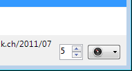

iRODS (Integrated Rule-Oriented Data System)
====

> The Integrated Rule-Oriented Data System (iRODS) is an open-source data management software used by research organizations and government agencies worldwide.

```{admonition} iRODS ...
:class: tip
- ... enables data discovery using a metadata catalog that describes every file, every directory, and every storage resource in the data grid.
- ... automates data workflows, with a rule engine that permits any action to be initiated by any trigger on any server or client in the grid.
- ... enables secure collaboration, so users only need to log in to their home grid to access data hosted on a remote grid.
- ... implement data virtualization, allowing access to distributed storage assets under a unified namespace, and freeing organizations from getting locked into single-vendor storage solutions.
```

## Connecting

Download the corresponding *Connection Profile* for preconfigured settings and double-click on it to install it. Choose the profile from the list of protocols when editing a [bookmark](../cyberduck/bookmarks.md) or use the `<vendor>:/` scheme when using the [CLI](../cli/index).

```{note}
All connection profiles are available through the *Preferences → Profiles* tab.
```

### Provider

- [CyVerse Data Store](http://www.cyverse.org/data-store) (Formerly iPlant Collaborative) - {download}`Connection Profile<http://profiles.cyberduck.io.s3.amazonaws.com/iRODS%20(iPlant%20Collaborative).cyberduckprofile>`
- RENCI - {download}`Connection Profile<http://profiles.cyberduck.io.s3.amazonaws.com/iRODS%20(RENCI).cyberduckprofile>`
- TACC - {download}`Connection Profile<http://profiles.cyberduck.io.s3.amazonaws.com/iRODS%20(TACC).cyberduckprofile>`

### Authentication

#### Authentication with Native Scheme

This is the default with no additional configuration required.

#### Authentication with PAM Scheme

To authenticate with PAM, prefix the username with PAM:or set it in the [connection profile](index.md#connection-profiles) using as

    <key>Authorization</key>
    <string>PAM</string>

### Ressource Server

You can specify a non-default resource server in the Region key of the [connection profile](index.md#connection-profiles) using a colon-separated syntax (Issue [#8721](https://github.com/iterate-ch/cyberduck/issues/8721)) such as

	<key>Region</key>
	<string>iplant:storageresourcename</string>

## Transfers

### Use Parallel Connections

If [multiple connections](../cyberduck/transfer.md#connections) are configured by default in *Preferences* or set in the bookmark options with *Transfer Files: Open multiple connections*, get and put transfers to the data store use parallel concurrent connections.


The number of parallel connections is controlled using the lower right stepper control in the [Transfers](../cyberduck/transfer.md) window.



## References

- [irods.org](http://irods.org/)
- [Downloading and Uploading Data](https://cyverse.atlassian.net/wiki/spaces/DS/pages/241869862/Downloading+and+Uploading+Data)
- [Using Cyberduck for Uploading and Downloading to the Data Store](https://cyverse.atlassian.net/wiki/spaces/DS/pages/241869843/Using+Cyberduck+for+Uploading+and+Downloading+to+the+Data+Store)
- [iRODS Error Events](https://github.com/irods/irods-legacy/blob/master/iRODS/lib/core/include/rodsErrorTable.h)