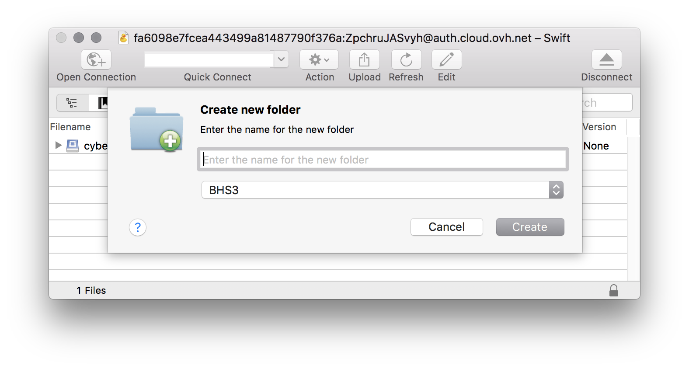

OVH Public Cloud Storage
====

> With the [OVH Object Storage](https://www.ovh.com/us/public-cloud/storage/object-storage/) cloud solution, you only pay for what you use with no limitation when it comes to size and duration. Thanks to the OpenStack Swift technology, you can store your high-performance data in the OVH cloud environment and instantly access it at any time. This solution is perfect for web projects and can be used to make your objects available through HTTP.

```{seealso}
[hubiC (OVH)](hubic)
```

## Connecting

*OVH Public Cloud Storage* is using [OpenStack Swift](index.md) APIs for its storage service.

### Connection Profile

{download}`Download<https://profiles.cyberduck.io/OVH%20Public%20Cloud%20Storage.cyberduckprofile>`  the *OVH Public Cloud Storage Connection Profile* or install it from *Preferences… → Profiles* for preconfigured settings.

### Manual Configuration

You will need to create a new user in the [OVH manager](https://www.ovh.com/manager/cloud/) in *Cloud → Servers → Project → OpenStack*. Choose *Download OpenStack configuration file* (`openrc.sh`) and open it in a text editor. Copy the values `OS_TENANT_ID:OS_USERNAME` for the username from the file.

- Server: `auth.cloud.ovh.net`
- Port: `443`
- Username: `OS_TENANT_ID:OS_USERNAME`
- Password: `Password`. You will find the password in the user list in *Project → OpenStack*.

## Cyberduck CLI

To use a connection, the corresponding profile must be [installed](../../cli/index.md#profiles) with the following parameters using [Cyberduck CLI](https://duck.sh/).

	duck --username OS_TENANT_ID:OS_USERNAME --password PROJECT_USER_PASSWORD --region BHS3 --list ovh://CONTAINERNAME

Alternatively, connect using the default connection profile by specifying the authentication hostname with

	duck --username OS_TENANT_ID:OS_USERNAME --password PROJECT_USER_PASSWORD --region BHS3 --list swift://auth.cloud.ovh.net/CONTAINERNAME

## Containers

You can choose the region when creating a new container with *File → New Folder…*.



## References
- [Manage Object Storage with Cyberduck](https://docs.ovh.com/us/en/storage/manage_object_storage_with_cyberduck/)
- [Configure user access to Horizon](https://docs.ovh.com/us/en/public-cloud/configure_user_access_to_horizon/)