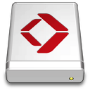

Exoscale
====

> [Exoscale Object Storage.](https://www.exoscale.com/object-storage/) An S3-compatible object storage service, with zones in Switzerland, Germany, Autria, and Bulgaria.

## Connecting

Download the *Exoscale* connection profile for the region in which your bucket is located or install it from *Preferences… → Profiles* for preconfigured settings.

- Austria
  - {download}`AT-VIE-1<https://profiles.cyberduck.io/Exoscale (at-vie-1).cyberduckprofile>`
  - {download}`AT-VIE-2<https://profiles.cyberduck.io/Exoscale (at-vie-2).cyberduckprofile>`
- Bulgaria
  - {download}`BG-SOF-1<https://profiles.cyberduck.io/Exoscale (bg-sof-1).cyberduckprofile>`
- Germany
  - {download}`DE-FRA-1<https://profiles.cyberduck.io/Exoscale (de-fra-1).cyberduckprofile>`
  - {download}`DE-MUC-1<https://profiles.cyberduck.io/Exoscale (de-muc-1).cyberduckprofile>`
- Switzerland
  - {download}`CH-DK-2<https://profiles.cyberduck.io/Exoscale (ch-dk-2).cyberduckprofile>`
  - {download}`CH-GVA-2<https://profiles.cyberduck.io/Exoscale (ch-gva-2).cyberduckprofile>`