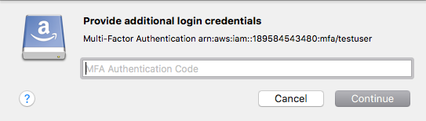
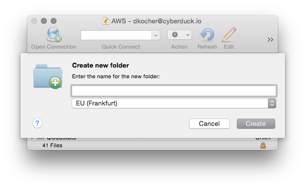
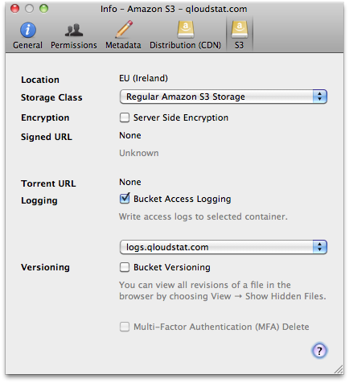
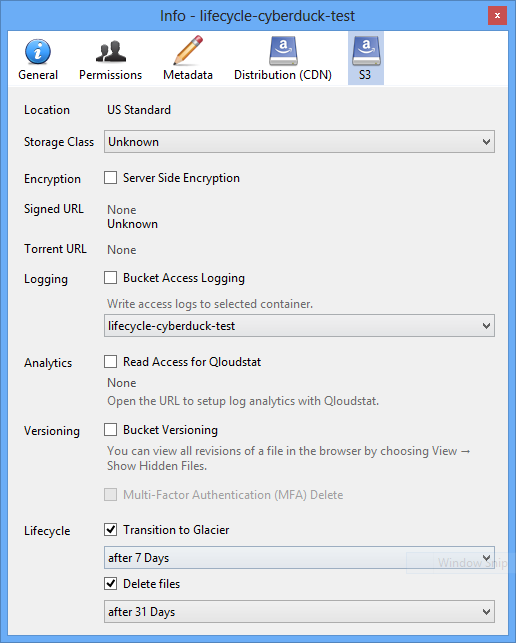
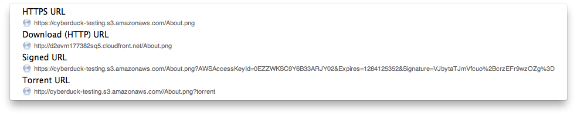
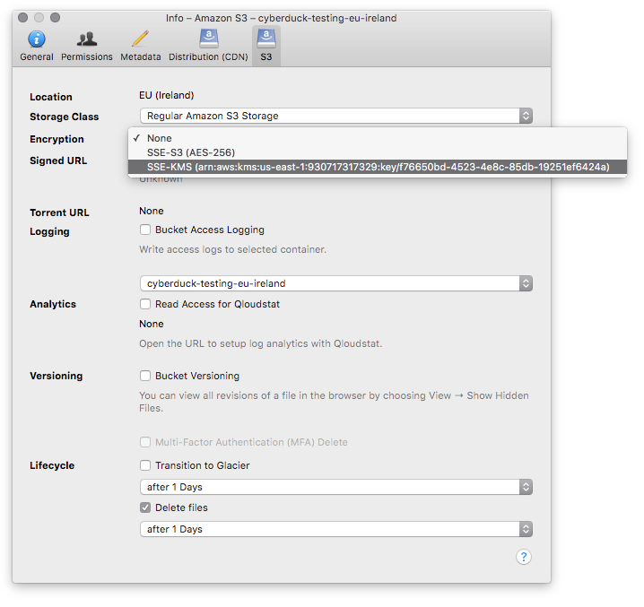
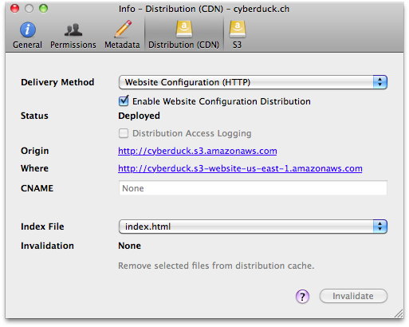

Amazon S3
====

:::{toctree}
:hidden:
:titlesonly:
providers
../../tutorials/s3_iam_role_mfa
../../tutorials/s3_iam_getsessiontoken_bucketpolicy_mfa
../../tutorials/s3_microsoft_entra_oidc
../../tutorials/s3_google_oidc
:::

:::{image} _images/s3.png
:alt: S3 Drive Icon
:width: 128px
:::

Transfer files to your [S3](http://aws.amazon.com/s3) account and browse the S3 buckets and files in a hierarchical way.

:::{contents} Content
:depth: 2
:local:
:::

## Connecting

You must obtain the login credentials (Access Key ID and Secret Access Key) of
your [Amazon Web Services Account](http://aws.amazon.com/account/) from the [*AWS Access Identifiers
page*](https://console.aws.amazon.com/iam/home?#security_credential). Enter the *Access Key ID* and *Secret Access Key*
in the login prompt.

### IAM User

You can also connect using [IAM](../../tutorials/iam.md) credentials that have the `Amazon S3 Full Access` template
policy permissions attached and optionally the `CloudFront Full Access`.

### Generic S3 Profiles

:::{note}
Connection profiles for use with [third-party S3 installations](providers.md) can be installed from *Preferences →
Profiles*.
:::

:::::{tabs}
::::{tab} AWS4

**Authentication with signature version AWS4-HMAC-SHA256**

:::{important}
It is discouraged to enable this option to connect plaintext to Amazon S3.
:::

If you have an S3 installation without SSL configured, you need an optional connection profile to connect using HTTP
only without transport layer security. You will then have the added option S3 (HTTP) in the protocol dropdown selection
in the [Connection](../../cyberduck/connection) and [Bookmark](../../cyberduck/bookmarks) panels.

- {download}`Download<https://profiles.cyberduck.io/S3%20(HTTP).cyberduckprofile>` the *S3 (HTTP) profile* for
  preconfigured settings.
- *S3 (HTTPS) profile* bundled by default.

::::
::::{tab} AWS2

**Authentication with signature version AWS2**

:::{attention}
Connection profiles using legacy AWS2 signature authentication are not recommended to be used with AWS S3 as some
regions and features like _Key Management Service_ and _CloudFront configuration_ are not supported.
:::

- {download}`Download<https://profiles.cyberduck.io/S3%20AWS2%20Signature%20Version%20(HTTP).cyberduckprofile>` the S3
  AWS2 Signature Version (HTTP) profile for preconfigured settings.
- {download}`Download<https://profiles.cyberduck.io/S3%20AWS2%20Signature%20Version%20(HTTPS).cyberduckprofile>` the S3
  AWS2 Signature Version (HTTPS) profile for preconfigured settings.

::::
::::{tab} AWS Gov Cloud

**S3 GovCloud (US-East)**

Use the endpoint `s3.us-gov-east-1.amazonaws.com` or install the connection profile

- {download}`Download<https://profiles.cyberduck.io/S3%20GovCloud%20(US-East).cyberduckprofile>` the *S3 GovCloud (
  US-East) profile* for preconfigured settings.

**S3 GovCloud (Us-West)**

Use the endpoint `s3.us-gov-west-1.amazonaws.com` or install the connection profile

- {download}`Download<https://profiles.cyberduck.io/S3%20GovCloud%20(US-East).cyberduckprofile>` the *S3 GovCloud (
  US-West) profile* for preconfigured settings.

::::
::::{tab} AWS China (Beijing)

**Connect to the region _AWS China (Beijing)_**

- {download}`Download<https://profiles.cyberduck.io/S3%20China%20(Beijing).cyberduckprofile>` the *S3 China (Beijing)
  profile* for preconfigured settings.
- {download}`Download<https://profiles.cyberduck.io/S3%20China%20(Ningxia).cyberduckprofile>` the *S3 China (Ningxia)
  profile* for preconfigured settings.

::::
::::{tab} AWS Private Link

**Connect
to [S3 interface VPC endpoint](https://docs.aws.amazon.com/AmazonS3/latest/userguide/privatelink-interface-endpoints.html)
**

- {download}`Download<https://profiles.cyberduck.io/AWS%20PrivateLink%20for%20Amazon%20S3%20(VPC%20endpoint).cyberduckprofile>`
  the *AWS PrivateLink for Amazon S3 (VPC endpoint) profile*.

::::
:::::

### Connecting to a Single Bucket

Connecting to a bucket owned by you or even a third party is possible without requiring permission to list all buckets.
You can access buckets owned by someone else if the ACL allows you to access it by *either*:

- Specify the bucket you want to access in the hostname to connect to like `<bucketname>.s3.amazonaws.com`. Your own
  buckets will not be displayed but only this bucket contents
- Set the *Default Path* in the bookmark to the bucket name. If you have permission you can still navigate one level up
  to display all buckets if the ACL allows.

:::{attention}
No regional endpoint should be set while connecting to a single bucket. The endpoint will be determined automatically by
querying the region of the bucket.
:::

### Connecting to a Public Bucket

To access public buckets with no access key required, you can choose _Anonymous Login_ instead of providing 
_Access Key ID_ and _Secret Access Key_.

### Connecting using Deprecated Path Style Requests

For S3 compatible storage only supporting path style requests to reference buckets. Connect with a connection profile
disabling virtual host style requests.

- {download}`Download<https://profiles.cyberduck.io/S3%20(Deprecated%20path%20style%20requests).cyberduckprofile>` the
  *S3 (Deprecated path style requests) profile* for preconfigured settings.

Alternatively set the [hidden configuration option](../../tutorials/hidden_properties.md)
`s3.bucket.virtualhost.disable` to `true`.

:::{admonition} Interoperability
:class: note

Attempting to connect using the regular S3 connection profile to a server with no support for virtual host style
requests will cause the error `Cannot read container configuration` with the message _DNS is the network service that
translates a server name to its Internet address. This error is most often caused by having no connection to the
Internet or a misconfigured network. It can also be caused by an unresponsive DNS server or a firewall preventing access
to the network._
:::

### Connecting with OpenID Connect (OIDC) Identity Provider

:::{important}

- Cyberduck [8.7.0](https://cyberduck.io/changelog/) or later required
- Mountain Duck [4.15.0](https://mountainduck.io/changelog/) or later required
  :::

Connecting to AWS S3 with web identity federation using AWS Security Token Service (STS) is supported with connection
profiles specifying configuration properties specific to your identity provider (IdP).

:::{attention}
The usage of these connection profiles requires
the [configuration](https://docs.aws.amazon.com/IAM/latest/UserGuide/id_roles_providers_create_oidc.html) of an OpenID
Connect (OIDC) identity provider and role and trust policy in AWS IAM.
:::

The connection profiles connect using temporary security credentials from the AWS Security Token Service (STS) obtained
using a web identity token from your OpenID Connect (OIDC) identity provider. Refer
to [Custom connection profile using OpenID Connect provider and AssumeRoleWithWebIdentity STS API](../profiles/aws_oidc.md).

:::{admonition} Interoperability
`AssumeRoleWithWebIdentity` API from AWS Security Token Service (STS) is used to exchange the JSON Web Token with
temporary security credentials. In addition to AWS, the following combinations of S3 & STS APIs with OpenID Connect (
OIDC) have been tested:

- Connect to MinIO S3 authenticating
  with [MinIO STS](https://min.io/docs/minio/linux/developers/security-token-service.html) and Keycloak (OIDC)
- Connect to AWS S3 authenticating with AWS STS and Keycloak (OIDC)
  :::

#### Sample Connection Profiles for Authorization with Well Known Identity Providers

:::{note}
When connecting the user is requested to enter the Role ARN of the IAM role that has a trust relationship configured
with the identity provider in _Identity and Access Management (IAM)_.
:::

##### S3 with Azure Active Directory (Azure AD)

- {download}`Download<https://profiles.cyberduck.io/AWS%20S3%2BSTS%20%26%20Azure%20Active%20Directory%20%28Azure%20AD%29%20OpenID%20Connect.cyberduckprofile>`
  the *AWS S3+STS &amp; Azure Active Directory (Azure AD) profile* for preconfigured settings

:::{admonition} Tutorial
:class: tip

Follow the [step-by-step instructions](../../tutorials/s3_microsoft_entra_oidc.md) to configure Microsoft Entra ID as an OpenID Connect (OIDC) Identity Provider in AWS IAM and authenticate with S3.
:::

##### S3 with Google OpenID Connect

- {download}`Download<https://profiles.cyberduck.io/AWS%20S3%2BSTS%20%26%20Google%20OpenID%20Connect.cyberduckprofile>`
  the *AWS S3+STS &amp; Google OpenID Connect profile* for preconfigured settings

### Connecting with Temporary Access Credentials (Token) from EC2

If you are running Cyberduck for Windows or [Cyberduck CLI](https://duck.sh/) on EC2 and have
setup [IAM Roles for Amazon EC2](http://docs.aws.amazon.com/AWSEC2/latest/UserGuide/iam-roles-for-amazon-ec2.html) to
provide access to S3 from the EC2 instance, you can use the connection profile below that will fetch temporary
credentials from EC2 instance metadata service at
`http://169.254.169.254/latest/meta-data/iam/security-credentials/s3access` to authenticate. Edit the profile to change
the role name `s3access` to match your IAM configuration.

- {download}`Download<https://profiles.cyberduck.io/S3%20(Credentials%20from%20Instance%20Metadata).cyberduckprofile>`
  the *S3 (Credentials from Instance Metadata) profile* for preconfigured settings

### Connecting Using Credentials from AWS Command Line Interface

Instead of providing Access Key ID and Secret Access Key, authenticate using credentials managed in `~/aws/credentials`
on macOS or `%USERPROFILE%\.aws\credentials` on Windows using third-party tools.

- {download}`Download<https://profiles.cyberduck.io/S3%20(Credentials%20from%20AWS%20Command%20Line%20Interface).cyberduckprofile>`
  the *S3 (Credentials from AWS Command Line Interface) profile* for preconfigured settings.

You must provide configuration in the standard credentials property file `~/.aws/credentials` on macOS or
`%USERPROFILE%\.aws\credentials` on Windows as well as the config file `~/aws/config` on macOS or
`%USERPROFILE%\.aws\config` on Windows
from [AWS Command Line Interface](https://docs.aws.amazon.com/cli/latest/userguide/cli-multiple-profiles.html).
Configure a bookmark with the field titled *Profile Name in` ~/.aws/credentials`* matching the profile name from
`~/.aws/credentials` on macOS or `%USERPROFILE%\.aws\credentials` on Windows. The properties `aws_access_key_id`,
`aws_secret_access_key` and `aws_session_token` are supported.

:::{admonition} Tutorial
:class: tip

Follow the [step-by-step instructions](../../tutorials/s3_iam_role_mfa.md) to require MFA by assuming a role to access S3.
:::

#### AWS IAM Identity Center

For a SSO connection authenticating with AWS IAM Identity Center (Successor to AWS Single Sign-On), the properties
`sso_start_url`, `sso_account_id`, and `sso_role_name` are required within the standard credentials property file
`~/.aws/credentials` (macOS) or `%USERPROFILE%\.aws\credentials` (Windows). The access key, secret key, and session
token cached by AWS CLI are retrieved from `~/.aws/cli/cache` on macOS or `%USERPROFILE%\.aws\cli\cache` on Windows.

To populate the correct cache locations follow these steps:

1. Run the command `aws sso login` to populate `~/.aws/sso/cache` on macOS or respectively
   `%USERPROFILE%\.aws\sso\cache` on Windows. This adds client secrets but doesn't add any usable AWS credentials.
2. Seed the second cache in `~/.aws/cli/cache` on macOS or respectively `%USERPROFILE%\.aws\cli\cache` on Windows by
   running the command `aws sts get-caller-identity`. This adds the usable credentials to the location Cyberduck and
   Mountain Duck reads from.

:::{note}
You can also do this for a specific profile by adding `--profile myProfile` to the commands. Make sure to use the same
profile for both steps.
:::

- [Configuring the AWS CLI to use AWS Single Sign-On](https://docs.aws.amazon.com/cli/latest/userguide/cli-configure-sso.html)

### Connecting Using AssumeRole from AWS Security Token Service (STS)

:::{admonition} Tutorial
:class: tip

Follow the [step-by-step instructions](../../tutorials/s3_iam_role_mfa.md) to require MFA with a user policy and connect by assuming a role from AWS Security Token Service (STS) granting access to S3.
:::

:::{admonition} Tutorial
:class: tip

Follow the [step-by-step instructions](../../tutorials/s3_iam_getsessiontoken_bucketpolicy_mfa.md) to require MFA with a bucket policy and connect using a session token from AWS Security Token Service (STS).
:::

Instead of providing Access Key ID and Secret Access Key, authenticate using temporary credentials from AWS Security
Token Service (STS) with optional Multi-Factor Authentication (MFA). Refer
to [Using IAM Roles](https://docs.aws.amazon.com/IAM/latest/UserGuide/id_roles_use.html).



- {download}`Download<https://profiles.cyberduck.io/AWS%20S3%20(STS%20Assume%20Role).cyberduckprofile>` the *AWS S3 (STS AssumeRole)* profile for preconfigured settings.
- {download}`Download<https://profiles.cyberduck.io/AWS%20S3%20(MFA%20Session%20Token).cyberduckprofile>` the *AWS S3 (MFA Session Token)* profile for preconfigured settings.
- {download}`Download<https://profiles.cyberduck.io/S3%20(Credentials%20from%20AWS%20Command%20Line%20Interface).cyberduckprofile>` the *S3 (Credentials from AWS Command Line Interface) profile* to connect with settings from AWS CLI. You must provide configuration in the standard credentials property file `~/.aws/credentials` on macOS or
`%USERPROFILE%\.aws\credentials` on Windows
from [AWS Command Line Interface](https://docs.aws.amazon.com/cli/latest/userguide/cli-multiple-profiles.html).
Configure a bookmark with the field titled *Profile Name in `~/.aws/credentials`* matching the profile name from
`~/.aws/credentials` on macOS or `%USERPROFILE%\.aws\credentials` on Windows with the `role_arn` configuration.

    #### Example Configuration
    
    Refer to [Assuming a Role](https://docs.aws.amazon.com/cli/latest/userguide/cli-roles.html).
    
    ```
    [testuser]
    aws_access_key_id=<access key for testuser>
    aws_secret_access_key=<secret key for testuser>
    [testrole]
    role_arn=arn:aws:iam::123456789012:role/testrole
    source_profile=testuser
    mfa_serial=arn:aws:iam::123456789012:mfa/testuser
    ```

### Read Credentials from `~/.aws/credentials`

When editing a bookmark, the *Access Key ID* is set from the `default` profile in the credentials file located at
`~/.aws/credentials` on macOS or `%USERPROFILE%\.aws\credentials` on Windows if such a profile exists or the profile name matching the .

### Connecting Without Using AWS credentials

Use the *S3 (HTTPS)* connection profile to access public data sets on [AWS Open Data](https://registry.opendata.aws/)
without using access keys by using the *Anonymous Login* option in the bookmark configuration.

:::{image} _images/S3_Anonymous_Login.png
:alt: S3 Anonymous Login
:width: 400px
:::

- {download}`Download<https://profiles.cyberduck.io/S3%20(HTTPS).cyberduckprofile>` the *S3 (HTTPS) profile* for
  preconfigured settings

## Cyberduck CLI

List all buckets with [Cyberduck CLI](https://duck.sh/) using

```
duck --username <Access Key ID> --list s3:/
```

List the contents of a bucket with

```
duck --username <Access Key ID>  --list s3:/<bucketname>/
```

Refer to the [Cyberduck CLI documentation](../../cli/index.md) for more operations.

### Uploads Using CLI

Add default metadata for uploads using
the [preferences option to read from the environment](../../cli/index.md#preferences). The property is documented
in [Default metadata](#default-metadata).

```
env "s3.metadata.default=Content-Type=application/xml" duck --upload …
```

Set a default ACL for the upload with

```
env "s3.acl.default=public-read" duck --upload …
```

## Buckets

### Creating a Bucket

To create a new [bucket](https://docs.aws.amazon.com/AmazonS3/latest/userguide/creating-bucket-s3.html) for your
account, browse to the root and choose *File → New Folder... (macOS `⌘N` Windows `Ctrl+Shift+N`)*. You can choose the
bucket location in *Preferences (macOS `⌘,` Windows `Ctrl+,`) → S3*. Note that Amazon has a different pricing scheme for
different regions.

:::{admonition} Mountain Duck
:class: note

You will receive a prompt for the region when creating a new bucket
:::

**Supported Regions**

- EU (Ireland)
- EU (London)
- EU (Paris)
- EU (Stockholm)
- US East (Northern Virginia)
- US West (Northern California)
- US West (Oregon)
- Asia Pacific (Singapore)
- Asia Pacific (Tokyo)
- South America (São Paulo)
- Asia Pacific (Sydney)
- EU (Frankfurt)
- US East (Ohio)
- Asia Pacific (Seoul)
- Asia Pacific (Mumbai)
- Canada (Montreal)
- China (Beijing)
- China (Ningxia)



:::{important}

- Because the bucket name must be globally unique the operation might fail if the name is already taken by someone
  else (E.g. don't assume any common name like *media* or *images* will be available).
- You cannot change the location of an existing bucket.
  :::

### Bucket Access Logging

When this option is enabled in the S3 panel of the Info (*File → Info (macOS `⌘I` Windows `Alt+Return`)*) window for a
bucket or any file within, available log records for this bucket are periodically aggregated into log files and
delivered to `/logs` in the target logging bucket specified. It is considered best practice to choose a logging target
that is different from the origin bucket.



To toggle CloudFront access logging, select the the [Distribution](../../protocols/cdn/cloudfront.md) panel in the
File → Info (macOS `⌘I` Windows `Alt+Return`) window.

### Requester Pays Buckets

Per default, buckets are accessed with the parameter `x-amz-requester-payer` in the header to allow access to files in
buckets with the *Requester Pays* option enabled.

You can change the parameter using the
following [hidden configuration options](../../cyberduck/preferences.md#hidden-configuration-options).

```
s3.bucket.requesterpays=true
```

- [Using Requester Pays buckets for storage transfers and usage](https://docs.aws.amazon.com/AmazonS3/latest/userguide/RequesterPaysBuckets.html)

### Versions

[Versioning](http://aws.amazon.com/s3/faqs/#What_is_Versioning) can be enabled per bucket in *File → Info (macOS `⌘I`
Windows `Alt+Return`) → S3*. Make sure the user has the following permissions:

- `s3:PutBucketVersioning` to permit users to modify the versioning configuration of a bucket.
- `s3:GetBucketVersioning` and `s3:ListBucketVersions` to see versions of a file.
- `s3:GetObjectVersion` to download a specific version.

You can view all revisions of a file in the browser by choosing *View → Show Hidden Files*.

#### Info → Versions

A list of file versions can be viewed in the *Versions* tab of the *[Info](../../cyberduck/info.md#versions)* window.
Files can be reverted to a chosen version of this list. Additionally, versions of the list can be deleted.

#### Revert

To revert to a previous version and make it the current, choose *File → Revert*.

#### Multi-Factor Authentication (MFA) Delete

To enable *Multi-Factor Authentication (MFA) Delete*, you need to purchase a
compatible [authentication device](http://aws.amazon.com/mfa/). Toggle MFA in *File → Info (macOS `⌘I`
Windows `Alt+Return`) → S3*. When enabled, you are prompted for the device number and one-time token in the login
prompt. Never reenter a token in the prompt already used before. A token is only valid for a single request. Wait for
the previous token to disappear from the device screen and request a new token from the device.


#### References

- [Using versioning in S3 buckets](https://docs.aws.amazon.com/AmazonS3/latest/dev/Versioning.html#MultiFactorAuthenticationDelete)

### Folders

Creating a folder inside a bucket will create a placeholder object named after the directory, has no data content, and
the MIME type `application/x-directory`. This is interoperable with folders created
with [AWS Management Console](http://aws.amazon.com/console/).

- [Organizing objects in the Amazon S3 console using folders](https://docs.aws.amazon.com/AmazonS3/latest/userguide/using-folders.html)

:::{important}
Do not name objects in S3 containing `/` as this will break navigation.
:::

## File Transfers

### Transfer Acceleration

When [enabled](../../cyberduck/info.md#provider-panel) for the bucket, downloads and uploads use the _S3 Transfer
Acceleration_ endpoints to transfer data through the globally distributed edge locations of AWS CloudFront.

:::{warning}
The name of the bucket used for Transfer Acceleration must be DNS-compliant and must not contain periods (".").
:::

:::{important}
You do **not** need to enter transfer accelerated endpoints manually. When using Transfer Acceleration, additional data
transfer charges may apply to connect to `s3-accelerate.dualstack.amazonaws.com`.
:::

:::{note}
Make sure the IAM user has the `s3:GetAccelerateConfiguration` permission required to query the Transfer Acceleration
status of a bucket.
:::

### Checksums

Files are verified both by AWS when the file is received and compared with the `SHA256` checksum sent with the request.
Additionally, the checksum returned by AWS for the uploaded file is compared with the checksum computed locally if
enabled in *Transfers → Checksum → Uploads → Verify checksum*.

### Multipart Uploads

Files larger than 100MB are uploaded in parts with up to 10 parallel connections as 10MB parts. Given these sizes, the
file size limit is 100GB with a maximum of 10'000 parts allowed by S3. The number of connections used can be limited
using the toggle in the lower right of the transfer window.

:::{note}
Multipart uploads can be resumed later when interrupted. Make sure the IAM user has the permission
`s3:ListBucketMultipartUploads`.
:::

#### Unfinished Multipart Uploads

You can view unfinished multipart uploads in the browser by choosing *View → Show Hidden Files*.

#### Options

You can set options with the
following [hidden configuration options](../../cyberduck/preferences.md#hidden-configuration-options).

- Part size for multipart uploads

```
s3.upload.multipart.size=10485760
```

- Threshold to use multipart uploads is set to 100MB by default

```
s3.upload.multipart.threshold=104857600
```

## Storage Class

You have the option to store files using the *Reduced Redundancy Storage (RRS)* by storing non-critical, reproducible
data at lower levels of redundancy. Set the default storage class in *Preferences (macOS `⌘,` Windows `Ctrl+,`) → S3*
and [edit the storage class](../../cyberduck/info.md#provider-panel) for already uploaded files using *File → Info (
macOS `⌘I` Windows `Alt+Return`) → S3*. Available storage classes are

- Regular Amazon S3 Storage
- Intelligent-Tiering
- Standard IA (Infrequent Access)
- One Zone-Infrequent Access
- Reduced Redundancy Storage (RRS)
- Glacier
- Glacier Deep Archive

:::{tip}
As the storage class applies to files selectively, it cannot be set as a default on a bucket. Therefore the storage
class is displayed as _Unknown_ for buckets.
:::

## Lifecycle Configuration

Specify after how many days a file in a bucket should be moved to Amazon Glacier or deleted.



## Restore from Glacier

:::{attention}
This feature is currently Cyberduck only.
:::

You can temporarily restore files from *Glacier* and *Glacier Deep Archive* using *File → Restore*. The file will be
restored using standard retrieval and expire 2 days after retrieval. Restoring takes some time and attempting to
download an item not yet restored will lead to an error *The operation is not valid for the object's storage class*.

### Glacier Retrieval Options

You can set retrieval options for the storage classes *Glacier* and *Glacier Deep Archive* with the
following [hidden configuration options](../../cyberduck/preferences.md#hidden-configuration-options).

* Set Glacier retrieval tier at which the restore will be processed. Valid values are `Standard`, `Bulk` and
  `Expedited`.
  ```
  s3.glacier.restore.tier=Standard
  ```

* Set the time, in days, between when an object is uploaded to the bucket and when it expires.
  ```
  s3.glacier.restore.expiration.days=2
  ```

:::{admonition} Mountain Duck
:class: note

Temporarily restored files from *Glacier* won't change the storage class and are not shown in Mountain Duck.
To make restored Glacier files available for retrieval in Mountain Duck, make sure to change the storage class
in [Info → S3 ](../../cyberduck/info.md#provider-panel) of Cyberduck.
:::

## Access Control (ACL)

Amazon S3 uses Access Control List (ACL) settings to control who may access or modify items stored in S3. You can edit
ACLs in *File → Info (macOS `⌘I` Windows `Alt+Return`) → Permissions*. Alternatively, permissions can be changed
using [bucket policies](https://docs.aws.amazon.com/AmazonS3/latest/userguide/bucket-policies.html).


:::{admonition} S3 Object Ownership
:class: warning

If you have
a [bucket owner enforced policy](https://docs.aws.amazon.com/AmazonS3/latest/userguide/about-object-ownership.html) set
with disabled ACLs for a bucket, it is required the IAM user
you connect with has permissions to read the bucket ownership controls. Ensure the user has
`s3:GetBucketOwnershipControls` permissions.
:::

### Canonical User ID Grantee

If you enter a user ID unknown to AWS, the error message `S3 Error Message. Bad Request. Invalid id.` will be displayed.

### Email Address Grantee

If you enter an email address unknown to AWS, the error message `S3 Error Message. Bad Request. Invalid id.` will be
displayed. If multiple accounts are registered with AWS for the given email address, the error message
`Bad Request. The e-mail address you provided is associated with more than one account. Please retry your request using a different identification method or after resolving the ambiguity.`
is returned.

### All Users Group Grantee

You must give the group grantee `http://acs.amazonaws.com/groups/global/AllUsers` read permissions for your objects to
make them accessible using a regular web browser for everyone.

If [bucket logging](index.md#bucket-access-logging) is enabled, the bucket ACL will have `READ_ACP` and `WRITE`
permissions for the group grantee `http://acs.amazonaws.com/groups/s3/LogDelivery`.

### Default ACLs

You can choose *canned ACLs* to be added to uploaded files or created buckets per default. *Canned ACLs* are predefined
sets of permissions.
The [default ACL](https://docs.aws.amazon.com/AmazonS3/latest/userguide/acl-overview.html#canned-acl) can be set within
*Preferences (macOS `⌘,` Windows `Ctrl+,`) → S3 → Default ACL*.

|                             | Applies to buckets | Applies to files |
|-----------------------------|:------------------:|:----------------:|
| `private`                   |         ✅          |        ✅         |
| `public-read`               |         ✅          |        ✅         |
| `public-read-write`         |         ✅          |        ✅         |
| `authenticated-read`        |         ✅          |        ✅         |
| `bucket-owner-read`         |         ❌	         |        ✅         |
| `bucket-owner-full-control` |         ❌	         |        ✅         |

You can [disable the ACLs](https://docs.aws.amazon.com/AmazonS3/latest/userguide/about-object-ownership.html) using the
_Amazon S3 Object Ownership_.

:::{note}
You need to set _Preferences → S3 → Default ACL → None_ for uploads with disabled ACLs to succeed. Otherwise uploads
fail with `The bucket does not allow ACLs.`.
:::

### Permissions

The following permissions can be given to grantees:

|                | Bucket                                                                 | Files                                                   |
|----------------|------------------------------------------------------------------------|---------------------------------------------------------|
| `READ`         | Allows grantee to list the files in the bucket                         | Allows grantee to download the file and its metadata    |
| `WRITE`        | Allows grantee to create, overwrite, and delete any file in the bucket | Not applicable                                          |
| `FULL_CONTROL` | Allows grantee all permissions on the bucket                           | Allows grantee all permissions on the object            |
| `READ_ACP`     | Allows grantee to read the bucket ACL                                  | Allows grantee to read the file ACL                     |
| `WRITE_ACP`    | Allows grantee to write the ACL for the applicable bucket              | Allows grantee to write the ACL for the applicable file |

:::{attention}
You may receive an error *Cannot change permissions of* when attempting to grant *Everyone READ* permission for a file
if the bucket has public access blocked
because [Block Public Access settings](https://docs.aws.amazon.com/AmazonS3/latest/userguide/access-control-block-public-access.html)
are turned on for this bucket.
:::

## Public URLs

You can access all URLs (including from [CDN](../../protocols/cdn/cloudfront.md) configurations) from the menu *Edit →
Copy URL and File → Open URL*.



:::{important}
Public URLs are only accessible if the permission `READ` is granted for `EVERYONE`.
:::

Choose *File → Share…* to change the ACL on the file permanently allowing read for everyone. You can reset the changed
ACL in [Info → ACL](../../cyberduck/info.md#access-control-list-acl).

### Pre-signed Temporary URLs

A private object stored in S3 can be made publicly available for a limited time using a pre-signed URL. The pre-signed
URL can be used by anyone to download the object, yet it includes a date and time after which the URL will no longer
work. Copy the pre-signed URL from *Edit → Copy URL→ Signed URL* or *File → Info (macOS `⌘I` Windows `Alt+Return`) →
S3*.

There are pre-signed URLs that expire in one hour, 24 hours (using the preference `s3.url.expire.seconds`), a week, and
a month. You can change the [hidden preference](../../cyberduck/preferences.md#hidden-configuration-options)
`s3.url.expire.seconds` from the default `86400` (24 hours).

:::{important}
It is required that your AWS credentials are saved in keychain. Refer
to [Passwords](../../cyberduck/connection.md#passwords).
:::

#### Force use of AWS2 Signature

Using the AWS4 signature version used in Cyberduck 5 and later, pre-signed URLs cannot have an expiry date later than a
week. You can revert by setting the default signature version to AWS2 by using the *S3 AWS2 Signature Version (HTTP)
connection profile*.

:::{note}
This deprecated signature version is not compatible with new regions such as `eu-central-1`.
:::

### Limitations

Share links cannot be created when failing to update the ACLs on a file because

- Bucket has "Object Ownership" set to "Bucket owner
  enforced" ([ACLs disabled](https://docs.aws.amazon.com/AmazonS3/latest/userguide/about-object-ownership.html?icmpid=docs_amazons3_console)).
  Error message: `This bucket does not allow ACLs`
- ["Block public access"](https://docs.aws.amazon.com/AmazonS3/latest/userguide/access-control-block-public-access.html?icmpid=docs_amazons3_console)
  is enabled on bucket. Error message: `Access denied`

## Metadata

You can edit standard HTTP headers and add [custom HTTP headers](../../cyberduck/info.md#metadata-http-headers) to files
to store [metadata](http://docs.amazonwebservices.com/AmazonS3/latest/index.html?UsingMetadata.html). Choose *File →
Info (macOS `⌘I` Windows `Alt+Return`) → Metadata* to edit headers.

### Default Metadata

Currently only possible using a [hidden configuration option](../../tutorials/hidden_properties.md) you can define
default headers to be added for uploads. Multiple headers must be separated using a whitespace delimiter. Key and value
of a header are separated with `=`. For example, if you want to add an HTTP header for Cache-Control and one named
`Creator` you would set

```
s3.metadata.default="Cache-Control=public,max-age=86400 Creator=Cyberduck"
```

### Cache Control Setting

This option lets you control how long a client accessing objects from your S3 bucket will cache the content and thus
lowering the number of access to your S3 storage. In conjunction with Amazon CloudFront, it controls the time an object
stays in an edge location until it expires. After the object expires, CloudFront must go back to the origin server the
next time that edge location needs to serve that object. By default, all objects automatically expire after 24 hours
when no custom `Cache-Control` header is set.

The default setting is `Cache-Control: public,max-age=2052000` when choosing to add a custom `Cache-Control` header in
the [Info](../../cyberduck/info.md) panel which translates to a cache expiration of one month (one month in seconds
equals more or less `60*60*24*30`).

Use the [hidden configuration option](../../tutorials/hidden_properties.md) `s3.cache.seconds` to set a custom default
value

```
s3.cache.seconds=2052000
```

### References

- [Amazon CloudFront and Your Live System](https://docs.aws.amazon.com/AmazonCloudFront/latest/DeveloperGuide/distribution-working-with.html)
- Read more
  about [Amazon CloudFront Object Expiration](http://docs.amazonwebservices.com/AmazonCloudFront/latest/DeveloperGuide/index.html?Expiration.html)

:::{tip}
Use `curl -I <http://<bucketname>.s3.amazonaws.com/<key>` to debug HTTP headers.
:::

## Server Side Encryption (SSE)

[Server-side encryption](http://docs.aws.amazon.com/AmazonS3/latest/dev/serv-side-encryption.html) for stored files is
supported and can be enabled by default for all uploads in the S3 preferences or for individual files in the *File →
Info (macOS `⌘I` Windows `Alt+Return`) → S3*. AWS handles key management and key protection for you.

### Defaults

Choose *Preferences → S3 → Server Side Encryption* to change the default.

- *None* will not encrypt files (Default).
- *SSE-S3* will encrypt files using *AES-256* with a default key provided by S3.
- *SSE-KMS* will encrypt files with the default key stored in AWS Key Management Service (KMS).

You can override these default settings in the *File → Info (macOS `⌘I` Windows `Alt+Return`) → S3* panel per bucket.

### Server-Side Encryption with Amazon S3-Managed Keys (SSE-S3)

When changing the setting for a folder or bucket you are prompted to confirm the recursive operation on all files
contained in the selected bucket or folder.

### Server-Side Encryption with AWS KMS-Managed Keys (SSE-KMS)

Among the default `SSE-S3 (AES-256)`, the server-side encryption (SSE) dropdown list allows choosing from all private
keys managed in AWS Key Management Service (KMS).

#### Permissions

This requires the `kms:ListKeys` and `kms:ListAliases` permission for the AWS credentials used to connect to S3.



When changing the setting for a folder or bucket you are prompted to confirm the recursive operation on all files
contained in the selected bucket or folder.

### Prevent Uploads of Unencrypted Files

Refer to the AWS Security Blog

- [How to Prevent Uploads of Unencrypted Objects to Amazon S3](https://aws.amazon.com/blogs/security/how-to-prevent-uploads-of-unencrypted-objects-to-amazon-s3/)

## CloudFront CDN

Amazon CloudFront delivers your static and streaming content using a global network of edge locations. Requests for your
objects are automatically routed to the nearest edge location, so content is delivered with the best possible
performance. Refer to [Amazon CloudFront distribution](../../protocols/cdn/cloudfront) for help about setting up
distributions.

## Website Configuration

To host a static website on S3, It is possible to define an Amazon S3 bucket as a *Website Endpoint*. The configuration
in *File → Info (macOS `⌘I` Windows `Alt+Return`) → Distribution* allows you to enable website configuration. Choose
*Website Configuration (HTTP)* from *Delivery Method* and define an index document name that is searched for and
returned when requests are made to the root or the subfolder of your website.

To access this website functionality, Amazon S3 exposes a new website endpoint for each region (US Standard, US West,
EU, or Asia Pacific). For example, `s3-website-ap-southeast-1.amazonaws.com` is the endpoint for the Asia Pacific
Region. The location is displayed in the *Where* field following the *Origin*.



To configure Amazon CloudFront for your website endpoints, refer
to [Website Configuration Endpoint Distributions with CloudFront CDN](../../protocols/cdn/cloudfront.md#website-configuration-endpoint-distributions-with-cloudfront-cdn).

### References

- [Host Your Static Website on Amazon S3](http://aws.typepad.com/aws/2011/02/host-your-static-website-on-amazon-s3.html)
- [Amazon S3 adds new features for hosting static websites](http://aws.amazon.com/about-aws/whats-new/2011/02/17/Amazon-S3-Website-Features/)

## Known Issues

### Modification Date

The modification date retention is only supported using the {download}
`S3 (Timestamps) profile<https://profiles.cyberduck.io/S3%20(Timestamps).cyberduckprofile>`. When using this connection
profile, the modification and creation dates get written into the metadata in form of `x-amz-meta-Mtime` and
`x-amz-meta-Btime` for files uploaded to S3. .

Listing folders will require an additional `HEAD` request for every file to read the modification date from the object
metadata. This can cause performance issues due to the excessive number of requests required with large directory
contents.

:::{tip}
Make sure to enable _Preserve modification date_ in *Preferences → Transfers → Timestamps* in Cyberduck.
:::

The {download}`S3 (Timestamps) profile<https://profiles.cyberduck.io/S3%20(Timestamps).cyberduckprofile>` is only
necessary if you want to view the timestamps set in the browser.

#### Interoperability

The timestamp metadata is interoperable with [rclone](https://rclone.org/s3/#modified-time).

### `Listing directory / failed.` with Path in Custom S3 Endpoint

When connecting to a service that requires a path prefix in all requests, you must set the `Context` property in a
custom [connection profile](../profiles/index.md).

### Moved Permanently but no Location Header

Make sure the IAM user has the permission `s3:GetBucketLocation` to read the bucket location.

### Writing Files to S3 Compatible Third-Party Service Provider may Fail

The S3 interoperable service must
support [multipart uploads](http://docs.aws.amazon.com/AmazonS3/latest/dev/mpuoverview.html).

### Delete Marker

When overwriting files some applications (like Windows File Explorer) will delete files prior to writing the new file.
Thus we also forward this delete operation to S3 resulting in the delete marker being set. You can overwrite files with
command-line tools which typically do not delete files prior to overwriting.

### In Finder.app, Creating a new Top-Level Folder in S3 Fails with

`Interoperability failure. Bucket name is not DNS compatible. Please contact your web hosting service provider for assistance.`

A bucket name in S3 cannot have whitespace in the filename. Because a new folder created with Finder.app is named
`Untitled Folder` the operation fails. As a workaround, create a new bucket with `mkdir` in *Terminal.app*.

:::{note}
The bucket can be created within the Smart Synchronization mode as the folder only gets uploaded after it is renamed.
Make sure to choose a filename with no whitespace. For the additional restrictions of the bucket name, refer to
the [AWS bucket naming rules](https://docs.aws.amazon.com/AmazonS3/latest/userguide/bucketnamingrules.html).
:::

### Saving a File in TextEdit.app will Attempt to Create a Folder

`/Temporary Items` on the Remote Volume. On some Servers, this may fail due to a Permission Failure or Because the Name
of the Folder is not Allowed as in S3.

<del>You will get the error message
`Bucket name is not DNS compatible. Please contact your web hosting service provider for assistance.`.</del> As of
Mountain Duck version 2.1, `.DS_Store` files are only saved in a temporary location and not stored on the mounted remote
volume.

## References

- [Grant access to user-specific folders in an Amazon S3 bucket](http://blogs.aws.amazon.com/security/post/Tx1P2T3LFXXCNB5/Writing-IAM-policies-Grant-access-to-user-specific-folders-in-an-Amazon-S3-bucke)
- [Amazon Simple Storage Service FAQs](http://aws.amazon.com/s3/faqs/)
- [Amazon Simple Storage Service Developer Guide](https://docs.aws.amazon.com/AmazonS3/latest/userguide/developing-s3.html)
