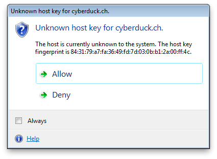
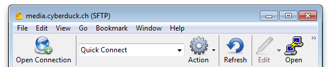
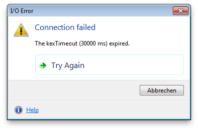

SFTP
====

:::{toctree}
:hidden:
:titlesonly:
providers
../../tutorials/sftp_publickeyauth
../../tutorials/sftp_publickeyauth_1password
../../tutorials/sftp_publickeyauth_bitwarden
../../tutorials/sftp_publickeyauth_yubikey
:::

:::{image} ../_images/ftp.png
:alt: FTP Drive Icon
:width: 128px
:::

:::{contents} Content
:depth: 2
:local:
:::

## Providers

Settings are specific to service [providers](providers.md).

:::{note}
Connection profiles can be installed from *Preferences → Profiles*.
:::

## Connecting

If you have access to a server using a secure shell ([SSH2](http://en.wikipedia.org/wiki/Secure_Shell_Protocol)), most probably `sftp-server` is also installed and configured, and you can connect using [SFTP](http://en.wikipedia.org/wiki/SSH_file_transfer_protocol).

### OpenSSH Configuration Interoperability

#### Public Key Fingerprints

Public key fingerprints are checked against and written to `~/ssh/known_hosts` when accepted. This does not apply to the Mac App Store version which does store key fingerprints in the preferences.

#### Configuration File

The following configuration options from `~/.ssh/config` are supported for SFTP connections:

- *IdentityFile* for public key authentication.
- *IdentityAgent* for public key authentication. Specifies the UNIX-domain socket used to communicate with the authentication agent.
- *HostName* aliases.
- *User* preference for login credentials.
- *ProxyJump* to connect via SSH tunnel through bastion server.
- *PreferredAuthentications* to limit authentication methods tried to login.
- *IdentitiesOnly*. Only try explicitly set private keys to authenticate but not all identities found in SSH agent. Resolves _Too many authentication failures_ errors with servers limiting the number of attempted authentication requests.
- A [bookmark](../../cyberduck/bookmarks.md) will update its public key authentication setting from the *IdentityFile* configuration in `~/.ssh/config`. Also when opening a new [connection](../../cyberduck/connection.md#toolbar-button) using *File → Open Connection…, IdentityFile* and *User* parameters in the OpenSSH user config file are auto completed.

Example `~/.ssh/config` configuration:

```
Host myhostname
	User myusername
	IdentityFile ~/.ssh/mykey-rsa
```

To use the same key for all hosts add a wildcard entry such as

```
Host *
	IdentityFile ~/.ssh/mykey-rsa
```

which is then used when configuring a new bookmark.

:::{important}
If you have a configuration in your `~/.ssh/config` make sure to specify the `Host` alias as _Server_ in your bookmark configuration. This is important for cases the `Host` alias is different from the `HostName`:

```
Host myhostalias
	HostName myverylonghostname.example.com
	User myusername
	IdentityFile ~/.ssh/mykey-rsa.pub
```

For the configuration above set `myhostalias` in the _Server_ field when editing a bookmark.
:::

#### Default Public Key Authentication Keys

You can enable the use of a default set of keys `~/.ssh/id_rsa` and `~/.ssh/id_dsa` (in this order) by setting the [hidden configuration option](../../tutorials/hidden_properties.md) `ssh.authentication.publickey.default.enable` to `true`.

```
ssh.authentication.publickey.default.enable=true
```

### Public Key Authentication

Private keys to authenticate with can be selected in the [Bookmark](../../cyberduck/bookmarks.md) or [Connection](../../cyberduck/connection.md) panel.

:::{admonition} Tutorial
:class: tip

Follow the [step-by-step instructions](../../tutorials/sftp_publickeyauth.md) to configure public key authentication with an OpenSSH server.
:::

#### PuTTY Key Format Interoperability

PuTTY private keys (`.ppk`) are supported for `rsa` key types. `ed25519` is not supported.

#### OpenSSH Key Format Interoperability

OpenSSH private keys of type `rsa`, `dsa`, `ecdsa` and `ed25519` (in OpenSSL `PEM` format) are supported. The new OpenSSH format (`openssh-key-v1`) is only supported for `ecdsa` and `ed25519`.

##### OpenSSH User Certificate Authentication

:::{important}
* Cyberduck [8.9.0](https://cyberduck.io/changelog/) or later required
* Mountain Duck [4.16.0](https://mountainduck.io/changelog/) or later required
:::

Applies to SSH servers, which are configured with [`TrustedUserCAKeys`](https://man.openbsd.org/sshd_config#TrustedUserCAKeys), refer to your software vendor for configuration. To configure authentication with a User CA signed private key, configure the private key as described in [Configure Public Key Authentication](#public-key-authentication) step 3. The signed public key file _must_ reside next to the private key file, suffixed `-cert.pub` or `.pub`. The [`CertificateFile`](https://man.openbsd.org/ssh_config#CertificateFile) configuration directive in `~/.ssh/config` is not supported. Pay attention to the server configuration and [`PubkeyAcceptedAlgorithms`](https://man.openbsd.org/sshd_config#PubkeyAcceptedAlgorithms) specifically which determines the allowed private key algorithms to authenticate with.

#### Public Key Authentication Using SSH Agent
When connecting to a SSH server, Cyberduck will lookup matching private keys from the SSH agent when attempting to authenticate with the server if no password is available and no explicit private key to use is configured in the bookmark.

:::{admonition} Mac App Store
:class: attention
The setting is not available in the version installed from the Mac App Store. Refer to [#13945](https://github.com/iterate-ch/cyberduck/issues/13945).
:::

::::{tabs}
:::{group-tab} macOS

The agent `ssh-agent` is running by default on macOS. You add private key identities to the authentication agent using the program `ssh-add`. The SSH agent is located using the `IdentityAgent` directive in `~/.ssh/config` or if missing from the environment variable `SSH_AUTH_SOCK`.

The following agents are supported:
 * OpenSSH `ssh-agent`.
 * [1Password SSH agent](https://developer.1password.com/docs/ssh/agent/compatibility/#cyberduck)
 * [Bitwarden](https://bitwarden.com/help/ssh-agent/#configure-bitwarden-ssh-agent)

Example `~/.ssh/config` configuration for 1Password:

```
Host myhostname
    # 1Password SSH agent
	IdentityAgent ~/.1password/agent.sock
```

Example `~/.ssh/config` configuration for Bitwarden:

```
Host myhostname
    # Bitwarden SSH agent
	IdentityAgent ~/.bitwarden-ssh-agent.sock
```


:::
:::{group-tab} Windows

The following agents are supported:
 * [Pageant](https://www.chiark.greenend.org.uk/~sgtatham/putty/latest.html). Refer to [How To Use Pageant to Streamline SSH Key Authentication with PuTTY](https://www.digitalocean.com/community/tutorials/how-to-use-pageant-to-streamline-ssh-key-authentication-with-putty).
 * OpenSSH for Windows using the pipe (`\\.\pipe\openssh-ssh-agent`) by default. Use `IdentityAgent` to set a custom socket path for any other compatible agent if needed. 
 * [1Password SSH agent](https://developer.1password.com/docs/ssh/agent/compatibility/#cyberduck)

:::
::::

:::{tip}
When authenticating using Public Key Authentication with an SSH agent containing multiple identities, add `IdentitiesOnly yes` in `~/.ssh/config` to limit authentication attempts with this identity only. Otherwise, the server may deny the connection because of too many login failures, and you will receive the error _Too many authentication failures_.
:::

Since the private key is not always available on the filesystem, specifying a public key as `IdentifyFile` is also supported. This is particularly useful when the private key is saved in a password manager and only exposed by a custom SSH agent.

Example `~/.ssh/config` configuration:

```
Host myhostname
	User myusername
	IdentityFile ~/.ssh/mykey-rsa.pub
	IdentitiesOnly yes
```

Alternatively you can select the public key file in the [bookmark](../../cyberduck/bookmarks.md#edit-bookmark) configuration.

### One-Time Passcodes (2FA)

Using a challenge-response authentication with one-time password generators such as [*DUO*](https://duo.com/product/multi-factor-authentication-mfa), [*SecurID*](https://www.rsa.com/products/securid/) or [*Google Authenticator*](https://github.com/google/google-authenticator) is supported. After the initial login prompt for the username and password, a second login prompt is displayed to enter the one-time passcode.

#### Google Authenticator

A setup with a two-step verification such as [Google Authenticator](https://github.com/google/google-authenticator) is supported.

Use the following configuration steps:
1. Install `libpam-google-authenticator` on the server.
2. Run `google-authenticator` to create a new account and scan the 2D barcode using the Authenticator application on your phone. Refer to [Install Google Authenticator](https://support.google.com/accounts/answer/1066447?hl=en).
3. Make it required for SSH logins by running `echo 'auth required pam_google_authenticator.so' >> /etc/pam.d/sshd`.
4. Add `ChallengeResponseAuthentication yes` to `/etc/ssh/sshd_config` with `echo 'ChallengeResponseAuthentication yes' >> /etc/ssh/sshd_config`.

When logging in, enter the time-based token requested after providing username and password.


- [PAM Module Instructions](https://github.com/google/google-authenticator/wiki/PAM-Module-Instructions)
- [How To Set Up Multi-Factor Authentication for SSH on Ubuntu 16.04](https://www.digitalocean.com/community/tutorials/how-to-set-up-multi-factor-authentication-for-ssh-on-ubuntu-16-04)

### Verify Host Keys

Upon connecting to an SSH server for the first time, you will see a message to verify the host key uniquely identifying the server. You can ask your provider for the public fingerprint of the server to make sure you are connecting to the right host. Subsequent connections to the SSH server will make sure that the host key does not have changed to prevent spoofing attacks.



### Connect via SSH Tunnel Through Bastion Server

:::{important}
Cyberduck [7.7](https://cyberduck.io/changelog/) or later required
:::

Using the `ProxyJump` configuration directive in `~/.ssh/config` you can connect through a tunnel. The bookmark configuration refers to the target host in the internal network. We should find a `ProxyJump` directive in the OpenSSH configuration `~/.ssh/config` matching the hostname in the bookmark.

Sample configuration:

```{code-block}
Host internal
   	HostName server.lan
   	ProxyJump user-external@jump.example.org:2222
   	User user-internal
```

You can also work with aliases like

```{code-block}
Host bastion-host-nickname
    HostName bastion-hostname
    User username
    Port 2222

Host remote-host-nickname
    HostName remote-hostname
    ProxyJump bastion-host-nickname
```

## Open in Terminal

Open in *Terminal* allows you to open an SSH shell for the current working directory with a single click.

:::{admonition} Mac App Store
:class: attention
The setting is not available in the version installed from the Mac App Store. Refer to [#7664](https://github.com/iterate-ch/cyberduck/issues/7664).
:::

::::{tabs}
:::{group-tab} macOS

**Terminal.app**

Use *View → Customize Toolbar...* to add the *Terminal.app* toolbar icon to your browser.


**Customize SSH Command:**<br/>
You can change the SSH command using the [hidden configuration option](../../tutorials/hidden_properties.md)

```
terminal.command.ssh=\"ssh\ -t\ {0}\ {1}@{2}\ -p\ {3}\ \\\"cd\ {4}\ \&\&\ exec\ \\\\\$SHELL\\\"\"
```

where

- {0} is `-i <path to the private key>`
- {1} is the username from the login credentials
- {2} is the hostname
- {3} is the port number of the remote host
- {4} is the current working directory in the browser

Because of all the escaping of characters, it might be easier to edit the key using *Property List Editor* if you have the developer tools installed. You can then set the string for the key `terminal.command.ssh to ssh -t {0} {1}@{2} -p {3} "cd {4} && exec \$SHELL"`. Test the string in *Terminal.app* first if it is valid.

**Using [iTerm2](https://www.iterm2.com/)**

**Version 7.4 and later:**<br/>
No configuration change is required. Choose *iTerm2 → Make iTerm2 Default Term* and restart Cyberduck. To revert, set the default application for a file named `.command` to *Terminal.app* in *Finder → Info → Open With…*.

**Previous versions:**<br/>
You can change a [hidden configuration option](../../tutorials/hidden_properties.md) to use a third-party terminal application instead of Terminal.app.

- Example for iTerm2 Version 2
```
defaults write ch.sudo.cyberduck terminal.bundle.identifier com.googlecode.iterm2
defaults write ch.sudo.cyberduck terminal.command \"set\ t\ to\ \(make\ new\ terminal\)\\ntell\ t\\nset\ s\ to\ \(launch\ session\ \\\"Default\ Session\\\"\)\\ntell\ s\\nwrite\ text\ \\\"{0}\\\"\\nend\ tell\\nend\ tell\"
```
- Example for iTerm2 Version 3
```
defaults write ch.sudo.cyberduck terminal.bundle.identifier com.googlecode.iterm2
defaults write ch.sudo.cyberduck terminal.command \"set\ t\ to\ \(create\ window\ with\ default\ profile\)\\ntell\ t\\nset\ s\ to\ \(current\ session\)\\ntell\ s\\nwrite\ text\ \\\"{0}\\\"\\nend\ tell\\nend\ tell\"
```

To reset to the default settings use:

```
defaults delete ch.sudo.cyberduck terminal.bundle.identifier
defaults delete ch.sudo.cyberduck terminal.command
```

:::
:::{group-tab} Windows

**Disable WSL**

There is a [hidden configuration option](../../tutorials/hidden_properties.md) for toggling additional SSH-terminal applications. Currently implemented are `ssh.exe` (OpenSSH built-in to Windows 10 since version 1709), `bash.exe` (using WSL and invoking `ssh` there) as well as PuTTY.

- Disabling OpenSSH: `terminal.openssh.enable=false`
- Disabling WSL: `terminal.windowssubsystemlinux.enable=false`

**PuTTY.exe**

Use *View → Customize Toolbar...* to add the *Open in Putty* toolbar icon to your browser.



**Location of the PuTTY installation:**<br/>
By default, the executable `putty.exe` must be located in your user home folder. You can change the install location by editing the [hidden configuration option](../../cyberduck/preferences.md#hidden-configuration-options) `terminal.command.ssh` to point to the path of the executable.

:::
::::

## Distribution (CDN)

You can enable custom origin [Amazon CloudFront (Content Delivery Network) distribution](../../protocols/cdn/cloudfront.md) using *File → Info → Distribution (CDN)*.

## Create and Expand ZIP or TAR Archives

The remote systems must have the archiving tools `tar` or `zip` installed respectively. Use *View → Customize Toolbar...* to add the Archive toolbar button to your browser window. It is not included in the default toolbar configuration.

:::{note}
_Send custom commands_ and _Create and expand ZIP/TAR Archives_ are limited to FTP and SFTP. 
:::

### Archive

Select one or more files to archive in the browser. For multiple files, a file with the name `Archive` with the given extension of the archive format will be created.


### Expand

Select one or more files to expand in the current working directory.

## Remote Commands

You can send any remote command to a remote SSH server. This is for example useful if you want a HTTP server to reload its configuration or changing the ownership of files using *chown* on a `UNIX` system.

:::{note}
The current working directory is always your use home. Determine using pwd to get the absolute path.
:::

:::{image} ../_images/command.png
:alt: Send Command
:width: 600px
:::

## Preferences

### Default Protocol Handler

You can set Cyberduck or a third-party application as the default application (protocol handler) for `SFTP` in *Preferences → SFTP*. When you click URLs in another application like your web browser, this application is opened to open the URL instead.

## Supported Algorithms

### Ciphers

`aes{128,192,256}-{cbc,ctr}`, `blowfish-{cbc,ctr}`, `3des-{cbc,ctr}`, `twofish{128,192,256}-{cbc,ctr}`, `twofish-cbc`, `serpent{128,192,256}-{cbc,ctr}`, `idea-{cbc,ctr}`, `cast128-{cbc,ctr}`, `arcfour`, `arcfour{128,256}`, `aes{128,256}-gcm@openssh.com`, `chacha20-poly1305@openssh.com`

### Key Exchange

`diffie-hellman-group1-sha1`, `diffie-hellman-group14-sha1`, `diffie-hellman-group14-sha256`, `diffie-hellman-group15-sha512`, `diffie-hellman-group16-sha512`, `diffie-hellman-group17-sha512`, `diffie-hellman-group18-sha512 diffie-hellman-group-exchange-sha1`, `diffie-hellman-group-exchange-sha256`, `ecdh-sha2-nistp256`, `ecdh-sha2-nistp384`, `ecdh-sha2-nistp521`, `curve25519-sha256@libssh.org`

### SSH Key Types

`ssh-rsa`, `ssh-dss`, `ecdsa-sha2-nistp256`, `ecdsa-sha2-nistp384`, `ecdsa-sha2-nistp521`, `ssh-ed25519`, `rsa-sha2-256`, `rsa-sha2-512`

### SSH Certificate Key Types

`ssh-rsa-cert-v01@openssh.com`, `ssh-dss-cert-v01@openssh.com`, `ecdsa-sha2-nistp256-cert-v01@openssh.com`, `ecdsa-sha2-nistp384-cert-v01@openssh.com`, `ecdsa-sha2-nistp521-cert-v01@openssh.com`, `ssh-ed25519-cert-v01@openssh.com`

### Compression

Compression with `zlib` and `zlib@openssh.com` is supported.

### Private Key Files

`pkcs5`, `pkcs8`, `openssh-key-v1`

## Incompatibilities

### Serv-U MFT

Serv-U MFT does not fully implement SFTPv3. Files cannot be created, renamed, uploaded as a required flag is not implemented and results in error messages.

## Known Issues

### Too Many Authentication Failures

Running an SSH agent with many added identities can lead to the server error _Too many authentication failures_ when trying to authenticate with all available identities. 

- Select the identity in the [bookmark](../../cyberduck/bookmarks.md#edit-bookmark) with _SSH Private Key_.
- Increase the allowed authentication tries on the *server* by adjusting [`MaxAuthTries`](https://man.openbsd.org/sshd_config.5#MaxAuthTries).

Possible remedies using configuration in [OpenSSH configuration file](#openssh-configuration-interoperability):
- [`IdentitiesOnly`](https://man.openbsd.org/ssh_config.5#IdentitiesOnly) in client configuration file `~/.ssh/config`. Only try to authenticate with explicitly set private key instead of all identities retrieved from SSH agent.
- Set [`PreferredAuthentications`](https://man.openbsd.org/ssh_config.5#PreferredAuthentications) in client configuration file `~/.ssh/config` to disable public key authentication for example.

### Illegal SFTP Packet Length: `Invalid packet: indicated length 1114795883 too large`

The error message `Invalid packet: indicated length 1114795883 too large` may indicate you have either:

- An `echo` statement in your shell init script like *.bashrc*. Make sure it does not output any text.
- Interoperability issue with Globalscape EFT Server (Issue [#5308](https://github.com/iterate-ch/cyberduck/issues/5308)).
- Possibly the server is printing a message similar to *Please login as the ubuntu user rather than root user*. Please verify the username for your connection.
- Enable SSH access on your server. Use the sftp command in a terminal to verify `sftp username@domain_name`. It'll ask for your password. If you don't have SSH access, you'll get "Received message too long", hence the error message.

### Kex Timeout

This error can occur if you are connecting the first time to a device with a slow processor. You can raise the tmeout value in *Preferences → Connection → Timeout*.



### Malformed `known_hosts`

Cyberduck refuses to connect if there are malformed entries in your `known_hosts` file located under `~/.ssh`. Renaming this file and recreating it usually resolves this. An alternative requires manually editing the `known_hosts` file removing all malformed entries. Please refer to [sshd(8)](https://man.openbsd.org/sshd.8#SSH_KNOWN_HOSTS_FILE_FORMAT) for a valid format.

### Mountain Duck

#### Symbolic Link not Accessible

Symbolic links are only resolved as such when the target points to a location on the mounted volume.

::::{tabs}
:::{group-tab} macOS

Symlinks can only be displayed as such if the target is pointing to a location on the mounted volume. Otherwise, they are displayed as a regular file or folder.

:::
:::{group-tab} Windows

Symlink is displayed as a regular file or folder.

:::
::::

#### File Permissions Reset when Saving File

:::{admonition} macOS
:class: note 

Mountain Duck will forward all permission changes from Finder or any other application to the SFTP server. There is a [hidden configuration option](../../tutorials/hidden_properties.md) `fs.setattr.chmod=false` to disable the writing of permissions.
:::

#### File Owner Reset When Saving File

:::{admonition} macOS
:class: note 

Some editors save files using an *Atomic Save* feature that writes changes to a file to a temporary file later replacing the edited file by renaming the temporary file to the name of the edited file. This works well on local filesystems, where there is support to retain the owner of the file that is different from the editing user using a special [function call](https://developer.apple.com/legacy/library/documentation/Darwin/Reference/ManPages/man2/exchangedata.2.html). This does not work for volumes mounted with Mountain Duck and the file owner will be reset to the default owner for new files created on the server by the logged-in user. As a workaround, try to find a setting for the editor to disable the *Atomic Save* feature.
:::

:::{seealso}
- [TextMate Atomic Saving](https://github.com/textmate/textmate/blob/master/Applications/TextMate/about/Changes.md#atomic-saving)
:::

#### Free Space Calculation is Incorrect

The available space for a volume mounted over SFTP is determined using quota features of the SSH protocol. Technically using the `space-available` extension of the SFTP protocol or the `statvfs@openssh.com` extension from OpenSSH. If the connected device returns an invalid value (e.g. from the disk the server is running instead of the data disk) you will get an incorrect calculation for the free space. You can work around the issue using one of the following options:
- Set a default path you want to connect to within the bookmark *Path* option.
- Disable the feature in Mountain Duck by setting the [hidden configuration option](../../tutorials/hidden_properties.md) `fs.quota.enable=false`.
