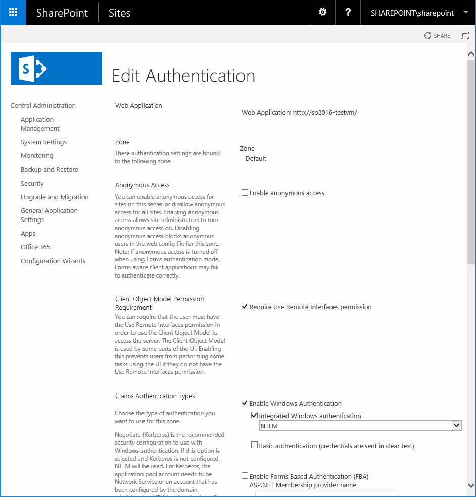

Microsoft SharePoint
====

## SharePoint Online

### Microsoft SharePoint Connection Profile

Connect to *SharePoint Online* with the built-in *Microsoft SharePoint connection profile*. Follow these steps to connect to your *SharePoint Online libraries*:

1. Create a bookmark with Microsoft SharePoint connection profile
2. Enter your email address into the username field. The email address is solely used for internal identification and not actual authentication against SharePoint using OAuth.
3. Double click to connect to the newly created bookmark. You are prompted to enter an *Authorization Code* you obtain in the web browser window opened. Login to `login.microsoftonline.com` with your `onmicrosoft.com` account.
4. Grant permission to *Cyberduck* for *OneDrive* and *SharePoint*.
5. You are redirected to `https://cyberduck.io/oauth/` where you can copy the *Authorization Code* to paste in the login prompt.
6. You are now able to access all sites, subsites, and document libraries thereof as well as all groups you are a member of.

### Microsoft SharePoint Site Connection Profile

In case you are trying to access a site that isn't listed when connecting with the *Microsoft SharePoint* connection profile you can try to access the missing site with help of the *Microsoft SharePoint Site* connection profile. While using the *Microsoft SharePoint Site* connection profile you are required to use your SharePoint hostname (`contoso.sharepoint.com`) and the URL prefix path configured for your SharePoint site. 

```{note}
You can't mount a specific directory with this method as the Path field is used for the URL prefix path.
```

### SharePoint Hybrid
If you have your own SharePoint Server but opted in to enable *Microsoft Graph*-connectivity to your SharePoint Server, you may be able to use the built-in *Microsoft SharePoint*-Profile.

Please refer to the official documentation from Microsoft for detailed setup guides.

- [Hybrid for SharePoint Server](https://support.office.com/en-us/article/sharepoint-hybrid-4c89a95a-a58c-4fc1-974a-389d4f195383)
- [Plan SharePoint Server hybrid](https://docs.microsoft.com/en-us/sharepoint/hybrid/plan-sharepoint-server-hybrid)

### Administrator Consent Required

Administrator-consent may be required in certain situations. Depending on the setup of your Azure Active Directory (AAD) you may need to perform several steps in order for you to be able to access your SharePoint Online. Please get in contact with your domain administrator for following steps.

### Manually Adding Cyberduck

Copy the link that corresponds to your used version, and send it to your domain administrator, this will add Cyberduck to the domain and all users are allowed to access Cyberduck in the future.

- [Cyberduck 7.8 & Mountain Duck 4.4](https://login.microsoftonline.com/organizations/v2.0/adminconsent?client_id=f40bc18f-cd02-4212-b7f1-15243e4e2ad3&redirect_uri=https://cyberduck.io/oauth&scope=sites.readwrite.all%20files.readwrite.all%20offline_access%20user.read%20group.read.all%20groupmember.read.all) or later.
- [Cyberduck 6.9 & Mountain Duck 2.7](https://login.microsoftonline.com/organizations/v2.0/adminconsent?client_id=372770ba-bb24-436b-bbd4-19bc86310c0e&redirect_uri=https://cyberduck.io/oauth&scope=sites.readwrite.all%20files.readwrite.all%20offline_access%20user.read%20group.read.all%20groupmember.read.all) or older.

### Automatically Allow Users to add Apps to the Domain

If applicable and trusted you may set `Users can consent to apps accessing company data on their behalf` to `Yes` at the [Azure Active Directory Portal](https://aad.portal.azure.com/#blade/Microsoft_AAD_IAM/StartboardApplicationsMenuBlade/UserSettings). This will allow users in the future to add apps without Admin-consent.

### Admin Consent Requests (Preview)

There is a preview method of review application consent through the Azure Active Directory (AAD) Portal. Please enable `Users can request admin consent to apps they are unable to consent to` to `Yes` in the [Enterprise applications - User settings](https://aad.portal.azure.com/#blade/Microsoft_AAD_IAM/StartboardApplicationsMenuBlade/UserSettings). The domain administrator may now review all consents centrally at [Admin consent requests (Preview)](https://aad.portal.azure.com/#blade/Microsoft_AAD_IAM/StartboardApplicationsMenuBlade/AccessRequests).

## SharePoint Server

To connect to a SharePoint Server, choose [WebDAV](webdav/index.md) for the connection type. This is available to

- SharePoint Server 2013
- SharePoint Server 2016
- SharePoint Server 2019

### Available Authentication Methods

#### Basic Authentication

Basic Authentication should only be used when using secured connection over TLS (HTTPS).

#### NTLM Authentication

If you need to set the `domain` and `workstation`, you can do so using a [hidden configuration option](../cyberduck/preferences.md#hidden-configuration-options).

	defaults write ch.sudo.cyberduck webdav.ntlm.workstation MYWORKSTATION
	defaults write ch.sudo.cyberduck webdav.ntlm.domain MYDOMAIN

#### Configuration

You may review your SharePoint authentication methods via `SharePoint Central Administration → Security → Specify authentication providers → Select zone`.



### Unavailable Authentication Methods

You may not connect to a SharePoint enabled site through WebDAV if any of these authentication methods is required:

- Kerberos (Issue [#133](https://github.com/iterate-ch/cyberduck/issues/12082))
- Forms Based Authentication
- Trusted Identity Provider
