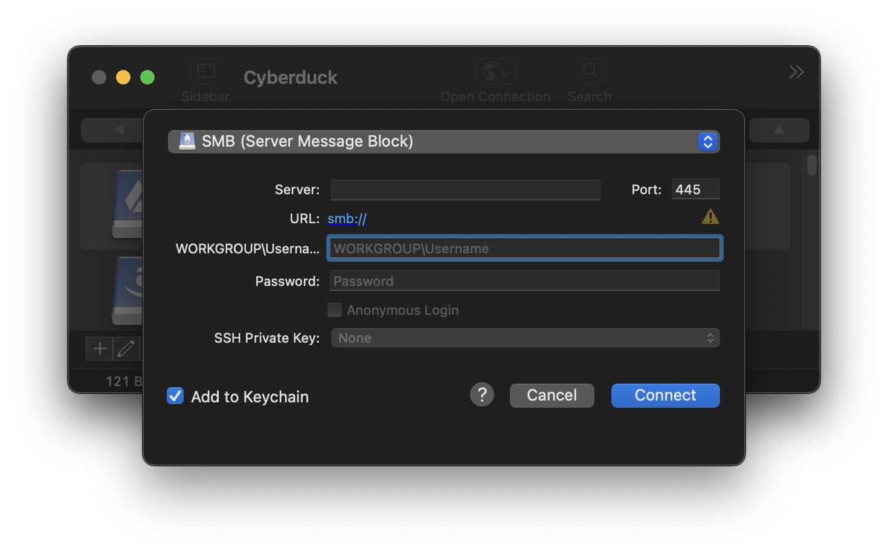
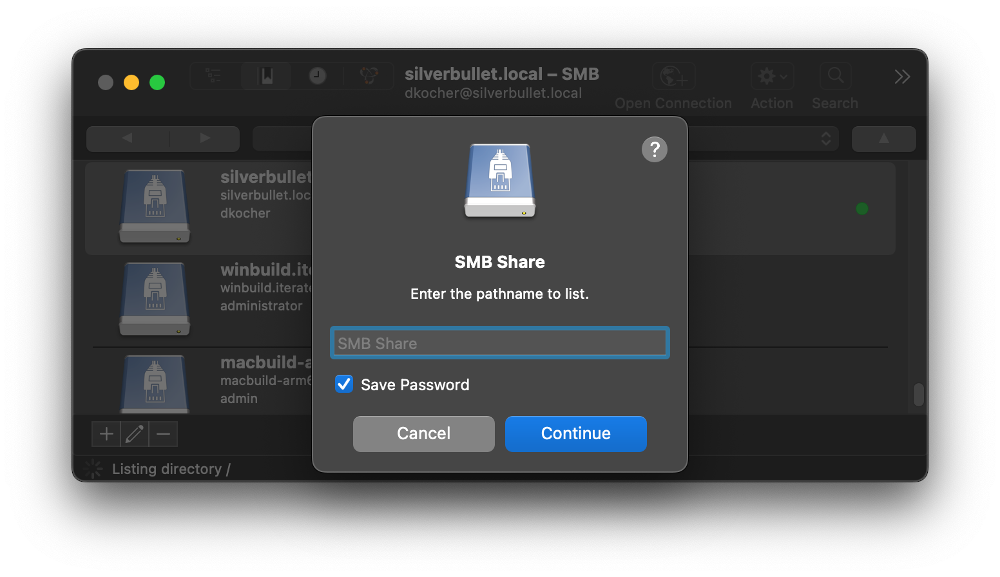

SMB
====

```{image} _images/ftp.png
:alt: FTP Drive Icon
:width: 128px
```

```{contents} Content
:depth: 2
:local:
```


> [SMB (Server Message Block)](https://en.wikipedia.org/wiki/Server_Message_Block) is used to access Windows File Shares or a Samba Linux Server.

## Connecting

To connect to a SMB server, choose _SMB (Server Message Block)_.



### Authentication
Username and password must be provided for authentication using NTLM. The optional domain name defaults to `WORKGROUP` and can be customized as part of the username in the format `domain@username` in the _Username_ input field when adding a bookmark.

### Share Name
To connect to a specific share, you can configure a _Path_ in the bookmark. When omitted an attempt is made to list all available shares from the server. On failure retrieving share names from the server, a prompt is displayed to enter the share name when connecting.



### Interoperability

SMB protocol support has been tested with connections to the following server implementations
- Windows 2016 Server 10.0.14393 (`SMB_3_1_1` dialect)
- Linux Samba (`SMB_3_1_1` dialect)
- macOS 13.5 (22G74) (`SMB_3_0_2` dialect)

### Cyberduck CLI

You can list shares with [Cyberduck CLI](https://duck.sh/) using

	duck --list smb:/server/share/
