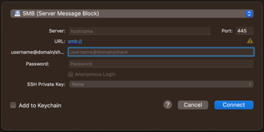

SMB
====

> [SMB (Server Message Block)](https://en.wikipedia.org/wiki/Server_Message_Block) is used to access Windows File Shares.

## Connecting

To connect to an SMB share fill out these fields.  

### Server

Enter the hostname of the server you want to connect to.

### Port

Change the port if necessary. Default for SMB is port 445.

### username@domain/share

Enter username, domain and share in the following style: `username@domain/share`  
The domain is optional and can be omitted with this style: `username/share`  
If no domain is provided, the default value of `WORKGROUP` is used.

### Password

Enter your password here. If no password is provided it will be prompted for.
