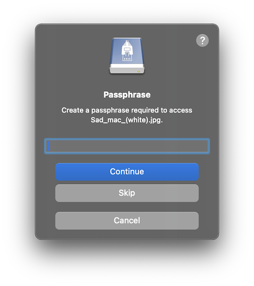
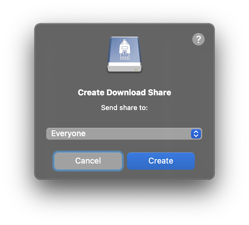

NextCloud & ownCloud
====

`````{tabs}

````{tab} Nextcloud

```{image} _images/Nextcloud_Drive_icon.png
:alt: Nextcloud Drive Icon
:height: 128px
```

> [Nextcloud Files](https://nextcloud.com/files/) is an on-premise, open-source file sync and share solution designed to be easy-to-use and highly secure.

````

````{tab} ownCloud

```{image} _images/ownCloud_Drive_icon.png
:alt: ownCloud Drive Icon
:height: 128px
```

> [ownCloud](https://owncloud.org/features/) is the most straightforward way to file sync and share data. You don’t need to worry about where or how to access your files. With ownCloud, all your data is where ever you are; accessible on all devices, any time.

````

`````

```{tip}
Download [Mountain Duck](https://mountainduck.io/) as an alternative to *Desktop Client* from Nextcloud & ownCloud.
```

## Connecting

### Connection Profiles

`````{tabs}
````{tab} Nextcloud

Select the connection profile `Nextcloud` for _Protocol_ bundled by default.
````

````{tab} ownCloud

Select the connection profile `ownCloud` for _Protocol_ bundled by default. 

**ownCloud Infinite Scale (oCIS)**

Connecting to *ownCloud Infinite Scale* the default authentication scheme is OpenID Connect. It requires the client registration in the identity provider in ownCloud via *Keycloak*. Additionally you need a custom [connection profile](https://github.com/iterate-ch/profiles/pull/83/files) to connect.

```{note}
Basic Authentication is disabled by default. For additional information refer to the [ownCloud documentation](https://doc.owncloud.com/ocis/next/deployment/services/s-list/auth-basic.html).
```

**Import client configuration for Keycloak**

To test without a custom deployment, use the public instance running at `ocis.ocis-keycloak.latest.owncloud.works` with the identity provider at `keycloak.ocis-keycloak.latest.owncloud.works` (username and password: `admin`).

The client configuration to match the provided connection profile can be imported from the [ownCloud Github repository](https://github.com/owncloud/ocis/blob/7af9cd9e53183acbaac2ffbc6414402bdef1f5d4/deployments/examples/ocis_keycloak/config/keycloak/clients/cyberduck.json) to allow OAuth authentications from [Cyberduck](https://cyberduck.io) & [Mountain Duck](https://mountainduck.io).

````
`````

Alternatively you can connect using `WebDAV (HTTPS)` with the default path set to `/remote.php/webdav/`.

```{tip}
The default path `/remote.php/dav/files/<username>` will be used with no custom setting in _Path_ to access the WebDAV API.
```

```{attention}
You are required to set a _Path_ only if your installation is accessible under a subdirectory such as `example.net/cloud/` this can be indicated by setting a default path of `directory/remote.php/webdav`. You can omit the value in _Path_ if your installation defaults to the root of your domain and is accessible at `example.net/remote.php/dav/files/<username>`. 
```

### Obtain WebDAV address from the server

1. Connect to your Nextcloud or ownCloud instance in your web browser and log in.
2. Click on the option Settings in the lower left of the screen and copy the displayed server address.
3. Create a new [bookmark](../../cyberduck/bookmarks.md):
In *Mountain Duck*, click on the icon in the tray area or status bar and choose the option *New Bookmark*.
In *Cyberduck*, click on *Bookmark* and choose the option *New Bookmark*.
4. Paste the previously copied server address into the *Server* field and finish editing. From the pasted URL the hostname is set in _Server_ and the document root of your Nextcloud or ownCloud installation in _Path_.
5. Type your *Username* into the corresponding field and press *Connect* in the bookmark window if available or double click from the bookmark window.
6. Upon connecting, enter your password when requested in the login prompt.

Alternatively use the *WebDAV (HTTPS)* profile.


```{warning}
Make sure to use the actual username instead of the email address for login credential.
```

### 2-Factor Authentication

With 2-factor authentication enabled, you will need to create an app password instead of your regular login credentials. You should find it in *Personal → App passwords*.


## Features

### Versioning

A list of file versions can be viewed in the *Versions* tab of the *[Info](../../cyberduck/info.md#versions)* window. Files can be reverted to a chosen version of this list. 

### Share & Request Files

Create different [shares](../../cyberduck/share.md#nextcloud--owncloud) using the context menu. By adding a passphrase in the corresponding you can build a password protected share. Alternatively skip the prompt to create a public share.



- Use *File → Request files…* to create upload shares for folders.

- Use *File → Share…* to create download shares. Choose between a public link by selecting `Everyone` and a privat link for another user by choosing a specific email address. The user will be notified about the shared file by email.



### Resumable Uploads

Connecting to *ownCloud Infinite Scale*, interrupted uploads can be resumed at any time.

```{note}
Cyberduck 8.9.0 or later is required.
```

## Known Limitations

### 0-Byte Files

If you are running an Apache configuration make sure to disable `fastcgi` and `php-fpm`. Refer to our [best practice for Nextcloud and ownCloud installations](../../mountainduck/issues/fastcgi.md).

### Modification Date

The modification date retention is supported using `X-OC-Mtime` for new files uploaded but without the option to adjust the modification date later.

## References

- [Accessing Nextcloud Files Using WebDAV](https://docs.nextcloud.com/server/13/user_manual/files/access_webdav.html)
- [Zero byte file truncate issue with Nextcloud and ownCloud deployed with FastCGI](../../mountainduck/issues/fastcgi.md)
