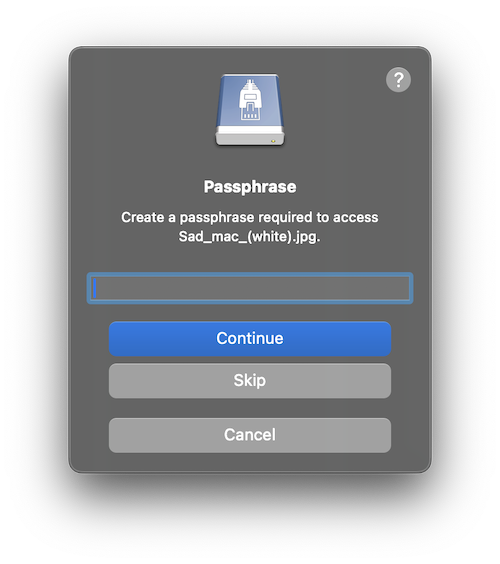
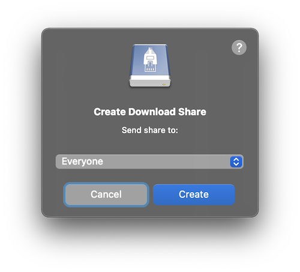

NextCloud, ownCloud & OpenCloud
====

:::::{tabs}
::::{group-tab} Nextcloud

:::{image} _images/Nextcloud_Drive_icon.png
:alt: Nextcloud Drive Icon
:height: 128px
:::

> [Nextcloud Files](https://nextcloud.com/files/) is an on-premise, open-source file sync and share solution designed to be easy-to-use and highly secure.

::::
::::{group-tab} ownCloud

:::{image} _images/ownCloud_Drive_icon.png
:alt: ownCloud Drive Icon
:height: 128px
:::

> [ownCloud](https://owncloud.org/features/) is the most straightforward way to file sync and share data. You don’t need to worry about where or how to access your files. With ownCloud, all your data is where ever you are; accessible on all devices, any time.

::::
::::{group-tab} OpenCloud

:::{image} _images/ownCloud_Drive_icon.png
:alt: OpenCloud Drive Icon
:height: 128px
:::

> [OpenCloud](https://opencloud.eu/en) is the Heinlein Group's file sharing & collaboration solution. Intelligent file management and a strong open source community turn files into valuable resources - effectively structured and usable in the long term.

::::
:::::

:::{tip}
Download [Mountain Duck](https://mountainduck.io/) as an alternative to *Desktop Client* from Nextcloud & ownCloud.
:::

## Connecting

### Connection Profiles

:::::{tabs}
::::{group-tab} Nextcloud

Select the connection profile `Nextcloud` for _Protocol_ bundled by default.

::::
::::{group-tab} ownCloud

Select the connection profile `ownCloud` for _Protocol_ bundled by default. 

::::
::::{group-tab} OpenCloud

Connecting to *OpenCloud* the default authentication scheme is OpenID Connect. For deployments using the built-in identity provider, use the ready-made connection profile with the OAuth client registered by default.

1. Open _Preferences… → Profiles_ in Cyberduck or Mountain Duck.
2. Enable the *OpenCloud (OpenID Connect)* connection profile.
3. Add a new [bookmark](../../cyberduck/bookmarks.md) and choose *OpenCloud (OpenID Connect)* in the protocol dropdown. Enter the hostname of your OpenCloud server in _Server_.
4. Connect to the bookmark and log in with your OpenCloud account in the web browser. Allow access for _OpenCloud Desktop Client_ when prompted.

:::{admonition} ownCloud Infinite Scale & OpenCloud with OpenID Connect Tutorial
:class: tip

For deployments using Keycloak or Microsoft Entra ID as the identity provider, follow the [step-by-step instructions](../../tutorials/owncloud_opencloud_oidc.md) to write a custom connection profile.
:::

::::
::::{group-tab} ownCloud Infinite Scale (oCIS)

Connecting to *ownCloud Infinite Scale* the default authentication scheme is OpenID Connect. For deployments using the built-in identity provider, use the ready-made connection profile with the OAuth client registered by default.

1. Open _Preferences… → Profiles_ in Cyberduck or Mountain Duck.
2. Enable the *ownCloud Infinite Scale (OpenID Connect)* connection profile.
3. Add a new [bookmark](../../cyberduck/bookmarks.md) and choose *ownCloud Infinite Scale (OpenID Connect)* in the protocol dropdown. Enter the hostname of your ownCloud Infinite Scale server in _Server_.
4. Connect to the bookmark and log in with your ownCloud account in the web browser. Allow access for _ownCloud desktop app_ when prompted.

:::{admonition} ownCloud Infinite Scale & OpenCloud with OpenID Connect Tutorial
:class: tip

For deployments using Keycloak or Microsoft Entra ID as the identity provider, follow the [step-by-step instructions](../../tutorials/owncloud_opencloud_oidc.md) to write a custom connection profile.
:::

:::{note}
Basic Authentication is disabled by default. For additional information refer to the [ownCloud documentation](https://doc.owncloud.com/ocis/next/deployment/services/s-list/auth-basic.html).
:::
::::

:::::

### Obtain WebDAV Address From Server

Connect to your Nextcloud or ownCloud server in your web browser and obtain the WebDAV address from _Settings_ in the lower left. Paste the copied server address into the *Server* field and finish editing. From the pasted URL the hostname is set in _Server_ and the document root of your Nextcloud or ownCloud installation in _Path_.

:::{warning}
Make sure to set in _Username_ the actual username instead of the email address.
:::

:::{tip}
The default path `/remote.php/dav/files/<username>` will be used with no custom setting in _Path_ to access the WebDAV API.
:::

:::{attention}
You are required to set a _Path_ only if your installation is accessible under a subdirectory such as `example.net/cloud/` this can be indicated by setting a default path of `directory/remote.php/webdav`. You can omit the value in _Path_ if your installation defaults to the root of your domain and is accessible at `example.net/remote.php/dav/files/<username>`.
:::

### 2-Factor Authentication

With 2-factor authentication enabled, you will need to create an app password instead of your regular login credentials. You should find it in *Personal → App passwords*.

## Features

### Versioning

A list of file versions can be viewed in the *Versions* tab of the *[Info](../../cyberduck/info.md#versions)* window. Files can be reverted to a chosen version of this list. 

### Share & Request Files

Create different [shares](../../cyberduck/share.md#nextcloud--owncloud) using the context menu. By adding a passphrase in the corresponding you can build a password protected share. Alternatively skip the prompt to create a public share.

- Use *File → Request files…* to create upload shares for folders.

- Use *File → Share…* to create download shares. Choose between a public link by selecting `Everyone` and a privat link for another user by choosing a specific email address. The user will be notified about the shared file by email.

### Resumable Uploads

Connecting to *ownCloud Infinite Scale*, interrupted uploads can be resumed at any time.

:::{note}
Cyberduck 8.9.0 or later is required.
:::

## Known Limitations

### 0-Byte Files

If you are running an Apache configuration make sure to disable `fastcgi` and `php-fpm`. Refer to our [best practice for Nextcloud and ownCloud installations](../../mountainduck/issues/fastcgi.md).

### Modification Date

The modification date retention is supported using `X-OC-Mtime` for new files uploaded but without the option to adjust the modification date later.

## References

- [Accessing Nextcloud Files Using WebDAV](https://docs.nextcloud.com/server/stable/user_manual/en/files/access_webdav.html)
- [Zero byte file truncate issue with Nextcloud and ownCloud deployed with FastCGI](../../mountainduck/issues/fastcgi.md)
